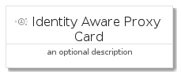
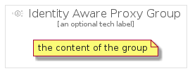

# IdentityAwareProxy


```text
gcp/Item/IdentityAwareProxy
```

```text
include('gcp/Item/IdentityAwareProxy')
```


| Illustration | IdentityAwareProxy | IdentityAwareProxyCard | IdentityAwareProxyGroup |
| :---: | :---: | :---: | :---: |
|  |  |  |  |


## IdentityAwareProxy

### Load remotely
```plantuml
@startuml
' configures the library
!global $LIB_BASE_LOCATION="https://raw.githubusercontent.com/tmorin/plantuml-libs/master/distribution"

' loads the library's bootstrap
!include $LIB_BASE_LOCATION/bootstrap.puml

' loads the package bootstrap
include('gcp/bootstrap')

' loads the Item which embeds the element IdentityAwareProxy
include('gcp/Item/IdentityAwareProxy')

' renders the element
IdentityAwareProxy('IdentityAwareProxy', 'Identity Aware Proxy', 'an optional tech label')
@enduml
```

### Load locally
```plantuml
@startuml
' configures the library
!global $INCLUSION_MODE="local"
!global $LIB_BASE_LOCATION="../.."

' loads the library's bootstrap
!include $LIB_BASE_LOCATION/bootstrap.puml

' loads the package bootstrap
include('gcp/bootstrap')

' loads the Item which embeds the element IdentityAwareProxy
include('gcp/Item/IdentityAwareProxy')

' renders the element
IdentityAwareProxy('IdentityAwareProxy', 'Identity Aware Proxy', 'an optional tech label')
@enduml
```

## IdentityAwareProxyCard

### Load remotely
```plantuml
@startuml
' configures the library
!global $LIB_BASE_LOCATION="https://raw.githubusercontent.com/tmorin/plantuml-libs/master/distribution"

' loads the library's bootstrap
!include $LIB_BASE_LOCATION/bootstrap.puml

' loads the package bootstrap
include('gcp/bootstrap')

' loads the Item which embeds the element IdentityAwareProxyCard
include('gcp/Item/IdentityAwareProxy')

' renders the element
IdentityAwareProxyCard('IdentityAwareProxyCard', 'Identity Aware Proxy Card', 'an optional description')
@enduml
```

### Load locally
```plantuml
@startuml
' configures the library
!global $INCLUSION_MODE="local"
!global $LIB_BASE_LOCATION="../.."

' loads the library's bootstrap
!include $LIB_BASE_LOCATION/bootstrap.puml

' loads the package bootstrap
include('gcp/bootstrap')

' loads the Item which embeds the element IdentityAwareProxyCard
include('gcp/Item/IdentityAwareProxy')

' renders the element
IdentityAwareProxyCard('IdentityAwareProxyCard', 'Identity Aware Proxy Card', 'an optional description')
@enduml
```

## IdentityAwareProxyGroup

### Load remotely
```plantuml
@startuml
' configures the library
!global $LIB_BASE_LOCATION="https://raw.githubusercontent.com/tmorin/plantuml-libs/master/distribution"

' loads the library's bootstrap
!include $LIB_BASE_LOCATION/bootstrap.puml

' loads the package bootstrap
include('gcp/bootstrap')

' loads the Item which embeds the element IdentityAwareProxyGroup
include('gcp/Item/IdentityAwareProxy')

' renders the element
IdentityAwareProxyGroup('IdentityAwareProxyGroup', 'Identity Aware Proxy Group', 'an optional tech label') {
    note as note
        the content of the group
    end note
}
@enduml
```

### Load locally
```plantuml
@startuml
' configures the library
!global $INCLUSION_MODE="local"
!global $LIB_BASE_LOCATION="../.."

' loads the library's bootstrap
!include $LIB_BASE_LOCATION/bootstrap.puml

' loads the package bootstrap
include('gcp/bootstrap')

' loads the Item which embeds the element IdentityAwareProxyGroup
include('gcp/Item/IdentityAwareProxy')

' renders the element
IdentityAwareProxyGroup('IdentityAwareProxyGroup', 'Identity Aware Proxy Group', 'an optional tech label') {
    note as note
        the content of the group
    end note
}
@enduml
```

