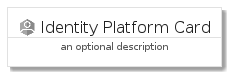
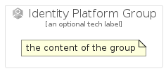

# IdentityPlatform


```text
gcp/Item/IdentityPlatform
```

```text
include('gcp/Item/IdentityPlatform')
```


| Illustration | IdentityPlatform | IdentityPlatformCard | IdentityPlatformGroup |
| :---: | :---: | :---: | :---: |
|  |  |  |  |


## IdentityPlatform

### Load remotely
```plantuml
@startuml
' configures the library
!global $LIB_BASE_LOCATION="https://raw.githubusercontent.com/tmorin/plantuml-libs/master/distribution"

' loads the library's bootstrap
!include $LIB_BASE_LOCATION/bootstrap.puml

' loads the package bootstrap
include('gcp/bootstrap')

' loads the Item which embeds the element IdentityPlatform
include('gcp/Item/IdentityPlatform')

' renders the element
IdentityPlatform('IdentityPlatform', 'Identity Platform', 'an optional tech label')
@enduml
```

### Load locally
```plantuml
@startuml
' configures the library
!global $INCLUSION_MODE="local"
!global $LIB_BASE_LOCATION="../.."

' loads the library's bootstrap
!include $LIB_BASE_LOCATION/bootstrap.puml

' loads the package bootstrap
include('gcp/bootstrap')

' loads the Item which embeds the element IdentityPlatform
include('gcp/Item/IdentityPlatform')

' renders the element
IdentityPlatform('IdentityPlatform', 'Identity Platform', 'an optional tech label')
@enduml
```

## IdentityPlatformCard

### Load remotely
```plantuml
@startuml
' configures the library
!global $LIB_BASE_LOCATION="https://raw.githubusercontent.com/tmorin/plantuml-libs/master/distribution"

' loads the library's bootstrap
!include $LIB_BASE_LOCATION/bootstrap.puml

' loads the package bootstrap
include('gcp/bootstrap')

' loads the Item which embeds the element IdentityPlatformCard
include('gcp/Item/IdentityPlatform')

' renders the element
IdentityPlatformCard('IdentityPlatformCard', 'Identity Platform Card', 'an optional description')
@enduml
```

### Load locally
```plantuml
@startuml
' configures the library
!global $INCLUSION_MODE="local"
!global $LIB_BASE_LOCATION="../.."

' loads the library's bootstrap
!include $LIB_BASE_LOCATION/bootstrap.puml

' loads the package bootstrap
include('gcp/bootstrap')

' loads the Item which embeds the element IdentityPlatformCard
include('gcp/Item/IdentityPlatform')

' renders the element
IdentityPlatformCard('IdentityPlatformCard', 'Identity Platform Card', 'an optional description')
@enduml
```

## IdentityPlatformGroup

### Load remotely
```plantuml
@startuml
' configures the library
!global $LIB_BASE_LOCATION="https://raw.githubusercontent.com/tmorin/plantuml-libs/master/distribution"

' loads the library's bootstrap
!include $LIB_BASE_LOCATION/bootstrap.puml

' loads the package bootstrap
include('gcp/bootstrap')

' loads the Item which embeds the element IdentityPlatformGroup
include('gcp/Item/IdentityPlatform')

' renders the element
IdentityPlatformGroup('IdentityPlatformGroup', 'Identity Platform Group', 'an optional tech label') {
    note as note
        the content of the group
    end note
}
@enduml
```

### Load locally
```plantuml
@startuml
' configures the library
!global $INCLUSION_MODE="local"
!global $LIB_BASE_LOCATION="../.."

' loads the library's bootstrap
!include $LIB_BASE_LOCATION/bootstrap.puml

' loads the package bootstrap
include('gcp/bootstrap')

' loads the Item which embeds the element IdentityPlatformGroup
include('gcp/Item/IdentityPlatform')

' renders the element
IdentityPlatformGroup('IdentityPlatformGroup', 'Identity Platform Group', 'an optional tech label') {
    note as note
        the content of the group
    end note
}
@enduml
```

