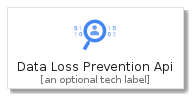
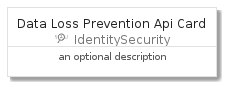
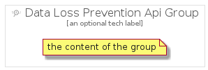

# DataLossPreventionApi


```text
gcp/Item/IdentitySecurity/DataLossPreventionApi
```

```text
include('gcp/Item/IdentitySecurity/DataLossPreventionApi')
```


| Illustration | DataLossPreventionApi | DataLossPreventionApiCard | DataLossPreventionApiGroup |
| :---: | :---: | :---: | :---: |
|  |  |  |  |


## DataLossPreventionApi

### Load remotely
```plantuml
@startuml
' configures the library
!global $LIB_BASE_LOCATION="https://github.com/tmorin/plantuml-libs/distribution"

' loads the library's bootstrap
!include $LIB_BASE_LOCATION/bootstrap.puml

' loads the package bootstrap
include('gcp/bootstrap')

' loads the Item which embeds the element DataLossPreventionApi
include('gcp/Item/IdentitySecurity/DataLossPreventionApi')

' renders the element
DataLossPreventionApi('DataLossPreventionApi', 'Data Loss Prevention Api', 'an optional tech label')
@enduml
```

### Load locally
```plantuml
@startuml
' configures the library
!global $INCLUSION_MODE="local"
!global $LIB_BASE_LOCATION="../../.."

' loads the library's bootstrap
!include $LIB_BASE_LOCATION/bootstrap.puml

' loads the package bootstrap
include('gcp/bootstrap')

' loads the Item which embeds the element DataLossPreventionApi
include('gcp/Item/IdentitySecurity/DataLossPreventionApi')

' renders the element
DataLossPreventionApi('DataLossPreventionApi', 'Data Loss Prevention Api', 'an optional tech label')
@enduml
```

## DataLossPreventionApiCard

### Load remotely
```plantuml
@startuml
' configures the library
!global $LIB_BASE_LOCATION="https://github.com/tmorin/plantuml-libs/distribution"

' loads the library's bootstrap
!include $LIB_BASE_LOCATION/bootstrap.puml

' loads the package bootstrap
include('gcp/bootstrap')

' loads the Item which embeds the element DataLossPreventionApiCard
include('gcp/Item/IdentitySecurity/DataLossPreventionApi')

' renders the element
DataLossPreventionApiCard('DataLossPreventionApiCard', 'Data Loss Prevention Api Card', 'an optional description')
@enduml
```

### Load locally
```plantuml
@startuml
' configures the library
!global $INCLUSION_MODE="local"
!global $LIB_BASE_LOCATION="../../.."

' loads the library's bootstrap
!include $LIB_BASE_LOCATION/bootstrap.puml

' loads the package bootstrap
include('gcp/bootstrap')

' loads the Item which embeds the element DataLossPreventionApiCard
include('gcp/Item/IdentitySecurity/DataLossPreventionApi')

' renders the element
DataLossPreventionApiCard('DataLossPreventionApiCard', 'Data Loss Prevention Api Card', 'an optional description')
@enduml
```

## DataLossPreventionApiGroup

### Load remotely
```plantuml
@startuml
' configures the library
!global $LIB_BASE_LOCATION="https://github.com/tmorin/plantuml-libs/distribution"

' loads the library's bootstrap
!include $LIB_BASE_LOCATION/bootstrap.puml

' loads the package bootstrap
include('gcp/bootstrap')

' loads the Item which embeds the element DataLossPreventionApiGroup
include('gcp/Item/IdentitySecurity/DataLossPreventionApi')

' renders the element
DataLossPreventionApiGroup('DataLossPreventionApiGroup', 'Data Loss Prevention Api Group', 'an optional tech label') {
    note as note
        the content of the group
    end note
}
@enduml
```

### Load locally
```plantuml
@startuml
' configures the library
!global $INCLUSION_MODE="local"
!global $LIB_BASE_LOCATION="../../.."

' loads the library's bootstrap
!include $LIB_BASE_LOCATION/bootstrap.puml

' loads the package bootstrap
include('gcp/bootstrap')

' loads the Item which embeds the element DataLossPreventionApiGroup
include('gcp/Item/IdentitySecurity/DataLossPreventionApi')

' renders the element
DataLossPreventionApiGroup('DataLossPreventionApiGroup', 'Data Loss Prevention Api Group', 'an optional tech label') {
    note as note
        the content of the group
    end note
}
@enduml
```

