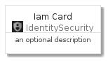
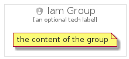

# Iam


```text
gcp/Item/IdentitySecurity/Iam
```

```text
include('gcp/Item/IdentitySecurity/Iam')
```


| Illustration | Iam | IamCard | IamGroup |
| :---: | :---: | :---: | :---: |
|  |  |  |  |


## Iam

### Load remotely
```plantuml
@startuml
' configures the library
!global $LIB_BASE_LOCATION="https://github.com/tmorin/plantuml-libs/distribution"

' loads the library's bootstrap
!include $LIB_BASE_LOCATION/bootstrap.puml

' loads the package bootstrap
include('gcp/bootstrap')

' loads the Item which embeds the element Iam
include('gcp/Item/IdentitySecurity/Iam')

' renders the element
Iam('Iam', 'Iam', 'an optional tech label')
@enduml
```

### Load locally
```plantuml
@startuml
' configures the library
!global $INCLUSION_MODE="local"
!global $LIB_BASE_LOCATION="../../.."

' loads the library's bootstrap
!include $LIB_BASE_LOCATION/bootstrap.puml

' loads the package bootstrap
include('gcp/bootstrap')

' loads the Item which embeds the element Iam
include('gcp/Item/IdentitySecurity/Iam')

' renders the element
Iam('Iam', 'Iam', 'an optional tech label')
@enduml
```

## IamCard

### Load remotely
```plantuml
@startuml
' configures the library
!global $LIB_BASE_LOCATION="https://github.com/tmorin/plantuml-libs/distribution"

' loads the library's bootstrap
!include $LIB_BASE_LOCATION/bootstrap.puml

' loads the package bootstrap
include('gcp/bootstrap')

' loads the Item which embeds the element IamCard
include('gcp/Item/IdentitySecurity/Iam')

' renders the element
IamCard('IamCard', 'Iam Card', 'an optional description')
@enduml
```

### Load locally
```plantuml
@startuml
' configures the library
!global $INCLUSION_MODE="local"
!global $LIB_BASE_LOCATION="../../.."

' loads the library's bootstrap
!include $LIB_BASE_LOCATION/bootstrap.puml

' loads the package bootstrap
include('gcp/bootstrap')

' loads the Item which embeds the element IamCard
include('gcp/Item/IdentitySecurity/Iam')

' renders the element
IamCard('IamCard', 'Iam Card', 'an optional description')
@enduml
```

## IamGroup

### Load remotely
```plantuml
@startuml
' configures the library
!global $LIB_BASE_LOCATION="https://github.com/tmorin/plantuml-libs/distribution"

' loads the library's bootstrap
!include $LIB_BASE_LOCATION/bootstrap.puml

' loads the package bootstrap
include('gcp/bootstrap')

' loads the Item which embeds the element IamGroup
include('gcp/Item/IdentitySecurity/Iam')

' renders the element
IamGroup('IamGroup', 'Iam Group', 'an optional tech label') {
    note as note
        the content of the group
    end note
}
@enduml
```

### Load locally
```plantuml
@startuml
' configures the library
!global $INCLUSION_MODE="local"
!global $LIB_BASE_LOCATION="../../.."

' loads the library's bootstrap
!include $LIB_BASE_LOCATION/bootstrap.puml

' loads the package bootstrap
include('gcp/bootstrap')

' loads the Item which embeds the element IamGroup
include('gcp/Item/IdentitySecurity/Iam')

' renders the element
IamGroup('IamGroup', 'Iam Group', 'an optional tech label') {
    note as note
        the content of the group
    end note
}
@enduml
```

