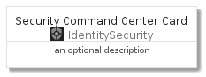
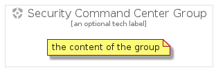

# SecurityCommandCenter


```text
gcp/Item/IdentitySecurity/SecurityCommandCenter
```

```text
include('gcp/Item/IdentitySecurity/SecurityCommandCenter')
```


| Illustration | SecurityCommandCenter | SecurityCommandCenterCard | SecurityCommandCenterGroup |
| :---: | :---: | :---: | :---: |
|  |  |  |  |


## SecurityCommandCenter

### Load remotely
```plantuml
@startuml
' configures the library
!global $LIB_BASE_LOCATION="https://github.com/tmorin/plantuml-libs/distribution"

' loads the library's bootstrap
!include $LIB_BASE_LOCATION/bootstrap.puml

' loads the package bootstrap
include('gcp/bootstrap')

' loads the Item which embeds the element SecurityCommandCenter
include('gcp/Item/IdentitySecurity/SecurityCommandCenter')

' renders the element
SecurityCommandCenter('SecurityCommandCenter', 'Security Command Center', 'an optional tech label')
@enduml
```

### Load locally
```plantuml
@startuml
' configures the library
!global $INCLUSION_MODE="local"
!global $LIB_BASE_LOCATION="../../.."

' loads the library's bootstrap
!include $LIB_BASE_LOCATION/bootstrap.puml

' loads the package bootstrap
include('gcp/bootstrap')

' loads the Item which embeds the element SecurityCommandCenter
include('gcp/Item/IdentitySecurity/SecurityCommandCenter')

' renders the element
SecurityCommandCenter('SecurityCommandCenter', 'Security Command Center', 'an optional tech label')
@enduml
```

## SecurityCommandCenterCard

### Load remotely
```plantuml
@startuml
' configures the library
!global $LIB_BASE_LOCATION="https://github.com/tmorin/plantuml-libs/distribution"

' loads the library's bootstrap
!include $LIB_BASE_LOCATION/bootstrap.puml

' loads the package bootstrap
include('gcp/bootstrap')

' loads the Item which embeds the element SecurityCommandCenterCard
include('gcp/Item/IdentitySecurity/SecurityCommandCenter')

' renders the element
SecurityCommandCenterCard('SecurityCommandCenterCard', 'Security Command Center Card', 'an optional description')
@enduml
```

### Load locally
```plantuml
@startuml
' configures the library
!global $INCLUSION_MODE="local"
!global $LIB_BASE_LOCATION="../../.."

' loads the library's bootstrap
!include $LIB_BASE_LOCATION/bootstrap.puml

' loads the package bootstrap
include('gcp/bootstrap')

' loads the Item which embeds the element SecurityCommandCenterCard
include('gcp/Item/IdentitySecurity/SecurityCommandCenter')

' renders the element
SecurityCommandCenterCard('SecurityCommandCenterCard', 'Security Command Center Card', 'an optional description')
@enduml
```

## SecurityCommandCenterGroup

### Load remotely
```plantuml
@startuml
' configures the library
!global $LIB_BASE_LOCATION="https://github.com/tmorin/plantuml-libs/distribution"

' loads the library's bootstrap
!include $LIB_BASE_LOCATION/bootstrap.puml

' loads the package bootstrap
include('gcp/bootstrap')

' loads the Item which embeds the element SecurityCommandCenterGroup
include('gcp/Item/IdentitySecurity/SecurityCommandCenter')

' renders the element
SecurityCommandCenterGroup('SecurityCommandCenterGroup', 'Security Command Center Group', 'an optional tech label') {
    note as note
        the content of the group
    end note
}
@enduml
```

### Load locally
```plantuml
@startuml
' configures the library
!global $INCLUSION_MODE="local"
!global $LIB_BASE_LOCATION="../../.."

' loads the library's bootstrap
!include $LIB_BASE_LOCATION/bootstrap.puml

' loads the package bootstrap
include('gcp/bootstrap')

' loads the Item which embeds the element SecurityCommandCenterGroup
include('gcp/Item/IdentitySecurity/SecurityCommandCenter')

' renders the element
SecurityCommandCenterGroup('SecurityCommandCenterGroup', 'Security Command Center Group', 'an optional tech label') {
    note as note
        the content of the group
    end note
}
@enduml
```

