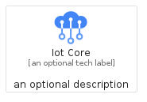
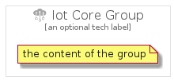

# IotCore


```text
gcp/Item/IotCore
```

```text
include('gcp/Item/IotCore')
```


| Illustration | IotCore | IotCoreCard | IotCoreGroup |
| :---: | :---: | :---: | :---: |
|  |  |  |  |


## IotCore

### Load remotely
```plantuml
@startuml
' configures the library
!global $LIB_BASE_LOCATION="https://raw.githubusercontent.com/tmorin/plantuml-libs/master/distribution"

' loads the library's bootstrap
!include $LIB_BASE_LOCATION/bootstrap.puml

' loads the package bootstrap
include('gcp/bootstrap')

' loads the Item which embeds the element IotCore
include('gcp/Item/IotCore')

' renders the element
IotCore('IotCore', 'Iot Core', 'an optional tech label')
@enduml
```

### Load locally
```plantuml
@startuml
' configures the library
!global $INCLUSION_MODE="local"
!global $LIB_BASE_LOCATION="../.."

' loads the library's bootstrap
!include $LIB_BASE_LOCATION/bootstrap.puml

' loads the package bootstrap
include('gcp/bootstrap')

' loads the Item which embeds the element IotCore
include('gcp/Item/IotCore')

' renders the element
IotCore('IotCore', 'Iot Core', 'an optional tech label')
@enduml
```

## IotCoreCard

### Load remotely
```plantuml
@startuml
' configures the library
!global $LIB_BASE_LOCATION="https://raw.githubusercontent.com/tmorin/plantuml-libs/master/distribution"

' loads the library's bootstrap
!include $LIB_BASE_LOCATION/bootstrap.puml

' loads the package bootstrap
include('gcp/bootstrap')

' loads the Item which embeds the element IotCoreCard
include('gcp/Item/IotCore')

' renders the element
IotCoreCard('IotCoreCard', 'Iot Core Card', 'an optional description')
@enduml
```

### Load locally
```plantuml
@startuml
' configures the library
!global $INCLUSION_MODE="local"
!global $LIB_BASE_LOCATION="../.."

' loads the library's bootstrap
!include $LIB_BASE_LOCATION/bootstrap.puml

' loads the package bootstrap
include('gcp/bootstrap')

' loads the Item which embeds the element IotCoreCard
include('gcp/Item/IotCore')

' renders the element
IotCoreCard('IotCoreCard', 'Iot Core Card', 'an optional description')
@enduml
```

## IotCoreGroup

### Load remotely
```plantuml
@startuml
' configures the library
!global $LIB_BASE_LOCATION="https://raw.githubusercontent.com/tmorin/plantuml-libs/master/distribution"

' loads the library's bootstrap
!include $LIB_BASE_LOCATION/bootstrap.puml

' loads the package bootstrap
include('gcp/bootstrap')

' loads the Item which embeds the element IotCoreGroup
include('gcp/Item/IotCore')

' renders the element
IotCoreGroup('IotCoreGroup', 'Iot Core Group', 'an optional tech label') {
    note as note
        the content of the group
    end note
}
@enduml
```

### Load locally
```plantuml
@startuml
' configures the library
!global $INCLUSION_MODE="local"
!global $LIB_BASE_LOCATION="../.."

' loads the library's bootstrap
!include $LIB_BASE_LOCATION/bootstrap.puml

' loads the package bootstrap
include('gcp/bootstrap')

' loads the Item which embeds the element IotCoreGroup
include('gcp/Item/IotCore')

' renders the element
IotCoreGroup('IotCoreGroup', 'Iot Core Group', 'an optional tech label') {
    note as note
        the content of the group
    end note
}
@enduml
```

