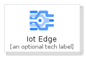
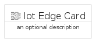
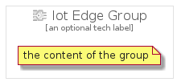

# IotEdge


```text
gcp/Item/IotEdge
```

```text
include('gcp/Item/IotEdge')
```


| Illustration | IotEdge | IotEdgeCard | IotEdgeGroup |
| :---: | :---: | :---: | :---: |
|  |  |  |  |


## IotEdge

### Load remotely
```plantuml
@startuml
' configures the library
!global $LIB_BASE_LOCATION="https://raw.githubusercontent.com/tmorin/plantuml-libs/master/distribution"

' loads the library's bootstrap
!include $LIB_BASE_LOCATION/bootstrap.puml

' loads the package bootstrap
include('gcp/bootstrap')

' loads the Item which embeds the element IotEdge
include('gcp/Item/IotEdge')

' renders the element
IotEdge('IotEdge', 'Iot Edge', 'an optional tech label')
@enduml
```

### Load locally
```plantuml
@startuml
' configures the library
!global $INCLUSION_MODE="local"
!global $LIB_BASE_LOCATION="../.."

' loads the library's bootstrap
!include $LIB_BASE_LOCATION/bootstrap.puml

' loads the package bootstrap
include('gcp/bootstrap')

' loads the Item which embeds the element IotEdge
include('gcp/Item/IotEdge')

' renders the element
IotEdge('IotEdge', 'Iot Edge', 'an optional tech label')
@enduml
```

## IotEdgeCard

### Load remotely
```plantuml
@startuml
' configures the library
!global $LIB_BASE_LOCATION="https://raw.githubusercontent.com/tmorin/plantuml-libs/master/distribution"

' loads the library's bootstrap
!include $LIB_BASE_LOCATION/bootstrap.puml

' loads the package bootstrap
include('gcp/bootstrap')

' loads the Item which embeds the element IotEdgeCard
include('gcp/Item/IotEdge')

' renders the element
IotEdgeCard('IotEdgeCard', 'Iot Edge Card', 'an optional description')
@enduml
```

### Load locally
```plantuml
@startuml
' configures the library
!global $INCLUSION_MODE="local"
!global $LIB_BASE_LOCATION="../.."

' loads the library's bootstrap
!include $LIB_BASE_LOCATION/bootstrap.puml

' loads the package bootstrap
include('gcp/bootstrap')

' loads the Item which embeds the element IotEdgeCard
include('gcp/Item/IotEdge')

' renders the element
IotEdgeCard('IotEdgeCard', 'Iot Edge Card', 'an optional description')
@enduml
```

## IotEdgeGroup

### Load remotely
```plantuml
@startuml
' configures the library
!global $LIB_BASE_LOCATION="https://raw.githubusercontent.com/tmorin/plantuml-libs/master/distribution"

' loads the library's bootstrap
!include $LIB_BASE_LOCATION/bootstrap.puml

' loads the package bootstrap
include('gcp/bootstrap')

' loads the Item which embeds the element IotEdgeGroup
include('gcp/Item/IotEdge')

' renders the element
IotEdgeGroup('IotEdgeGroup', 'Iot Edge Group', 'an optional tech label') {
    note as note
        the content of the group
    end note
}
@enduml
```

### Load locally
```plantuml
@startuml
' configures the library
!global $INCLUSION_MODE="local"
!global $LIB_BASE_LOCATION="../.."

' loads the library's bootstrap
!include $LIB_BASE_LOCATION/bootstrap.puml

' loads the package bootstrap
include('gcp/bootstrap')

' loads the Item which embeds the element IotEdgeGroup
include('gcp/Item/IotEdge')

' renders the element
IotEdgeGroup('IotEdgeGroup', 'Iot Edge Group', 'an optional tech label') {
    note as note
        the content of the group
    end note
}
@enduml
```

