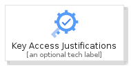
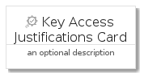
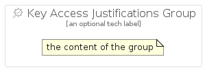

# KeyAccessJustifications


```text
gcp/Item/KeyAccessJustifications
```

```text
include('gcp/Item/KeyAccessJustifications')
```


| Illustration | KeyAccessJustifications | KeyAccessJustificationsCard | KeyAccessJustificationsGroup |
| :---: | :---: | :---: | :---: |
|  |  |  |  |


## Sprites
The item provides the following sriptes:

- `<$KeyAccessJustificationsXs>`
- `<$KeyAccessJustificationsSm>`
- `<$KeyAccessJustificationsMd>`
- `<$KeyAccessJustificationsLg>`


## KeyAccessJustifications

### Load remotely
```plantuml
@startuml
' configures the library
!global $LIB_BASE_LOCATION="https://raw.githubusercontent.com/tmorin/plantuml-libs/master/distribution"

' loads the library's bootstrap
!include $LIB_BASE_LOCATION/bootstrap.puml

' loads the package bootstrap
include('gcp/bootstrap')

' loads the Item which embeds the element KeyAccessJustifications
include('gcp/Item/KeyAccessJustifications')

' renders the element
KeyAccessJustifications('KeyAccessJustifications', 'Key Access Justifications', 'an optional tech label', 'an optional description')
@enduml
```

### Load locally
```plantuml
@startuml
' configures the library
!global $INCLUSION_MODE="local"
!global $LIB_BASE_LOCATION="../.."

' loads the library's bootstrap
!include $LIB_BASE_LOCATION/bootstrap.puml

' loads the package bootstrap
include('gcp/bootstrap')

' loads the Item which embeds the element KeyAccessJustifications
include('gcp/Item/KeyAccessJustifications')

' renders the element
KeyAccessJustifications('KeyAccessJustifications', 'Key Access Justifications', 'an optional tech label', 'an optional description')
@enduml
```

## KeyAccessJustificationsCard

### Load remotely
```plantuml
@startuml
' configures the library
!global $LIB_BASE_LOCATION="https://raw.githubusercontent.com/tmorin/plantuml-libs/master/distribution"

' loads the library's bootstrap
!include $LIB_BASE_LOCATION/bootstrap.puml

' loads the package bootstrap
include('gcp/bootstrap')

' loads the Item which embeds the element KeyAccessJustificationsCard
include('gcp/Item/KeyAccessJustifications')

' renders the element
KeyAccessJustificationsCard('KeyAccessJustificationsCard', 'Key Access Justifications Card', 'an optional description')
@enduml
```

### Load locally
```plantuml
@startuml
' configures the library
!global $INCLUSION_MODE="local"
!global $LIB_BASE_LOCATION="../.."

' loads the library's bootstrap
!include $LIB_BASE_LOCATION/bootstrap.puml

' loads the package bootstrap
include('gcp/bootstrap')

' loads the Item which embeds the element KeyAccessJustificationsCard
include('gcp/Item/KeyAccessJustifications')

' renders the element
KeyAccessJustificationsCard('KeyAccessJustificationsCard', 'Key Access Justifications Card', 'an optional description')
@enduml
```

## KeyAccessJustificationsGroup

### Load remotely
```plantuml
@startuml
' configures the library
!global $LIB_BASE_LOCATION="https://raw.githubusercontent.com/tmorin/plantuml-libs/master/distribution"

' loads the library's bootstrap
!include $LIB_BASE_LOCATION/bootstrap.puml

' loads the package bootstrap
include('gcp/bootstrap')

' loads the Item which embeds the element KeyAccessJustificationsGroup
include('gcp/Item/KeyAccessJustifications')

' renders the element
KeyAccessJustificationsGroup('KeyAccessJustificationsGroup', 'Key Access Justifications Group', 'an optional tech label') {
    note as note
        the content of the group
    end note
}
@enduml
```

### Load locally
```plantuml
@startuml
' configures the library
!global $INCLUSION_MODE="local"
!global $LIB_BASE_LOCATION="../.."

' loads the library's bootstrap
!include $LIB_BASE_LOCATION/bootstrap.puml

' loads the package bootstrap
include('gcp/bootstrap')

' loads the Item which embeds the element KeyAccessJustificationsGroup
include('gcp/Item/KeyAccessJustifications')

' renders the element
KeyAccessJustificationsGroup('KeyAccessJustificationsGroup', 'Key Access Justifications Group', 'an optional tech label') {
    note as note
        the content of the group
    end note
}
@enduml
```

