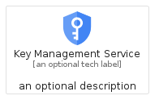
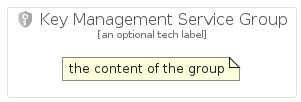

# KeyManagementService


```text
gcp/Item/KeyManagementService
```

```text
include('gcp/Item/KeyManagementService')
```


| Illustration | KeyManagementService | KeyManagementServiceCard | KeyManagementServiceGroup |
| :---: | :---: | :---: | :---: |
|  |  |  |  |


## KeyManagementService

### Load remotely
```plantuml
@startuml
' configures the library
!global $LIB_BASE_LOCATION="https://raw.githubusercontent.com/tmorin/plantuml-libs/master/distribution"

' loads the library's bootstrap
!include $LIB_BASE_LOCATION/bootstrap.puml

' loads the package bootstrap
include('gcp/bootstrap')

' loads the Item which embeds the element KeyManagementService
include('gcp/Item/KeyManagementService')

' renders the element
KeyManagementService('KeyManagementService', 'Key Management Service', 'an optional tech label', 'an optional description')
@enduml
```

### Load locally
```plantuml
@startuml
' configures the library
!global $INCLUSION_MODE="local"
!global $LIB_BASE_LOCATION="../.."

' loads the library's bootstrap
!include $LIB_BASE_LOCATION/bootstrap.puml

' loads the package bootstrap
include('gcp/bootstrap')

' loads the Item which embeds the element KeyManagementService
include('gcp/Item/KeyManagementService')

' renders the element
KeyManagementService('KeyManagementService', 'Key Management Service', 'an optional tech label', 'an optional description')
@enduml
```

## KeyManagementServiceCard

### Load remotely
```plantuml
@startuml
' configures the library
!global $LIB_BASE_LOCATION="https://raw.githubusercontent.com/tmorin/plantuml-libs/master/distribution"

' loads the library's bootstrap
!include $LIB_BASE_LOCATION/bootstrap.puml

' loads the package bootstrap
include('gcp/bootstrap')

' loads the Item which embeds the element KeyManagementServiceCard
include('gcp/Item/KeyManagementService')

' renders the element
KeyManagementServiceCard('KeyManagementServiceCard', 'Key Management Service Card', 'an optional description')
@enduml
```

### Load locally
```plantuml
@startuml
' configures the library
!global $INCLUSION_MODE="local"
!global $LIB_BASE_LOCATION="../.."

' loads the library's bootstrap
!include $LIB_BASE_LOCATION/bootstrap.puml

' loads the package bootstrap
include('gcp/bootstrap')

' loads the Item which embeds the element KeyManagementServiceCard
include('gcp/Item/KeyManagementService')

' renders the element
KeyManagementServiceCard('KeyManagementServiceCard', 'Key Management Service Card', 'an optional description')
@enduml
```

## KeyManagementServiceGroup

### Load remotely
```plantuml
@startuml
' configures the library
!global $LIB_BASE_LOCATION="https://raw.githubusercontent.com/tmorin/plantuml-libs/master/distribution"

' loads the library's bootstrap
!include $LIB_BASE_LOCATION/bootstrap.puml

' loads the package bootstrap
include('gcp/bootstrap')

' loads the Item which embeds the element KeyManagementServiceGroup
include('gcp/Item/KeyManagementService')

' renders the element
KeyManagementServiceGroup('KeyManagementServiceGroup', 'Key Management Service Group', 'an optional tech label') {
    note as note
        the content of the group
    end note
}
@enduml
```

### Load locally
```plantuml
@startuml
' configures the library
!global $INCLUSION_MODE="local"
!global $LIB_BASE_LOCATION="../.."

' loads the library's bootstrap
!include $LIB_BASE_LOCATION/bootstrap.puml

' loads the package bootstrap
include('gcp/bootstrap')

' loads the Item which embeds the element KeyManagementServiceGroup
include('gcp/Item/KeyManagementService')

' renders the element
KeyManagementServiceGroup('KeyManagementServiceGroup', 'Key Management Service Group', 'an optional tech label') {
    note as note
        the content of the group
    end note
}
@enduml
```

