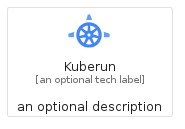
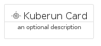
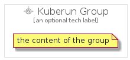

# Kuberun


```text
gcp/Item/Kuberun
```

```text
include('gcp/Item/Kuberun')
```


| Illustration | Kuberun | KuberunCard | KuberunGroup |
| :---: | :---: | :---: | :---: |
|  |  |  |  |


## Kuberun

### Load remotely
```plantuml
@startuml
' configures the library
!global $LIB_BASE_LOCATION="https://raw.githubusercontent.com/tmorin/plantuml-libs/master/distribution"

' loads the library's bootstrap
!include $LIB_BASE_LOCATION/bootstrap.puml

' loads the package bootstrap
include('gcp/bootstrap')

' loads the Item which embeds the element Kuberun
include('gcp/Item/Kuberun')

' renders the element
Kuberun('Kuberun', 'Kuberun', 'an optional tech label', 'an optional description')
@enduml
```

### Load locally
```plantuml
@startuml
' configures the library
!global $INCLUSION_MODE="local"
!global $LIB_BASE_LOCATION="../.."

' loads the library's bootstrap
!include $LIB_BASE_LOCATION/bootstrap.puml

' loads the package bootstrap
include('gcp/bootstrap')

' loads the Item which embeds the element Kuberun
include('gcp/Item/Kuberun')

' renders the element
Kuberun('Kuberun', 'Kuberun', 'an optional tech label', 'an optional description')
@enduml
```

## KuberunCard

### Load remotely
```plantuml
@startuml
' configures the library
!global $LIB_BASE_LOCATION="https://raw.githubusercontent.com/tmorin/plantuml-libs/master/distribution"

' loads the library's bootstrap
!include $LIB_BASE_LOCATION/bootstrap.puml

' loads the package bootstrap
include('gcp/bootstrap')

' loads the Item which embeds the element KuberunCard
include('gcp/Item/Kuberun')

' renders the element
KuberunCard('KuberunCard', 'Kuberun Card', 'an optional description')
@enduml
```

### Load locally
```plantuml
@startuml
' configures the library
!global $INCLUSION_MODE="local"
!global $LIB_BASE_LOCATION="../.."

' loads the library's bootstrap
!include $LIB_BASE_LOCATION/bootstrap.puml

' loads the package bootstrap
include('gcp/bootstrap')

' loads the Item which embeds the element KuberunCard
include('gcp/Item/Kuberun')

' renders the element
KuberunCard('KuberunCard', 'Kuberun Card', 'an optional description')
@enduml
```

## KuberunGroup

### Load remotely
```plantuml
@startuml
' configures the library
!global $LIB_BASE_LOCATION="https://raw.githubusercontent.com/tmorin/plantuml-libs/master/distribution"

' loads the library's bootstrap
!include $LIB_BASE_LOCATION/bootstrap.puml

' loads the package bootstrap
include('gcp/bootstrap')

' loads the Item which embeds the element KuberunGroup
include('gcp/Item/Kuberun')

' renders the element
KuberunGroup('KuberunGroup', 'Kuberun Group', 'an optional tech label') {
    note as note
        the content of the group
    end note
}
@enduml
```

### Load locally
```plantuml
@startuml
' configures the library
!global $INCLUSION_MODE="local"
!global $LIB_BASE_LOCATION="../.."

' loads the library's bootstrap
!include $LIB_BASE_LOCATION/bootstrap.puml

' loads the package bootstrap
include('gcp/bootstrap')

' loads the Item which embeds the element KuberunGroup
include('gcp/Item/Kuberun')

' renders the element
KuberunGroup('KuberunGroup', 'Kuberun Group', 'an optional tech label') {
    note as note
        the content of the group
    end note
}
@enduml
```

