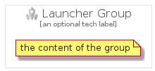

# Launcher


```text
gcp/Item/Launcher
```

```text
include('gcp/Item/Launcher')
```


| Illustration | Launcher | LauncherCard | LauncherGroup |
| :---: | :---: | :---: | :---: |
|  |  |  |  |


## Launcher

### Load remotely
```plantuml
@startuml
' configures the library
!global $LIB_BASE_LOCATION="https://raw.githubusercontent.com/tmorin/plantuml-libs/master/distribution"

' loads the library's bootstrap
!include $LIB_BASE_LOCATION/bootstrap.puml

' loads the package bootstrap
include('gcp/bootstrap')

' loads the Item which embeds the element Launcher
include('gcp/Item/Launcher')

' renders the element
Launcher('Launcher', 'Launcher', 'an optional tech label', 'an optional description')
@enduml
```

### Load locally
```plantuml
@startuml
' configures the library
!global $INCLUSION_MODE="local"
!global $LIB_BASE_LOCATION="../.."

' loads the library's bootstrap
!include $LIB_BASE_LOCATION/bootstrap.puml

' loads the package bootstrap
include('gcp/bootstrap')

' loads the Item which embeds the element Launcher
include('gcp/Item/Launcher')

' renders the element
Launcher('Launcher', 'Launcher', 'an optional tech label', 'an optional description')
@enduml
```

## LauncherCard

### Load remotely
```plantuml
@startuml
' configures the library
!global $LIB_BASE_LOCATION="https://raw.githubusercontent.com/tmorin/plantuml-libs/master/distribution"

' loads the library's bootstrap
!include $LIB_BASE_LOCATION/bootstrap.puml

' loads the package bootstrap
include('gcp/bootstrap')

' loads the Item which embeds the element LauncherCard
include('gcp/Item/Launcher')

' renders the element
LauncherCard('LauncherCard', 'Launcher Card', 'an optional description')
@enduml
```

### Load locally
```plantuml
@startuml
' configures the library
!global $INCLUSION_MODE="local"
!global $LIB_BASE_LOCATION="../.."

' loads the library's bootstrap
!include $LIB_BASE_LOCATION/bootstrap.puml

' loads the package bootstrap
include('gcp/bootstrap')

' loads the Item which embeds the element LauncherCard
include('gcp/Item/Launcher')

' renders the element
LauncherCard('LauncherCard', 'Launcher Card', 'an optional description')
@enduml
```

## LauncherGroup

### Load remotely
```plantuml
@startuml
' configures the library
!global $LIB_BASE_LOCATION="https://raw.githubusercontent.com/tmorin/plantuml-libs/master/distribution"

' loads the library's bootstrap
!include $LIB_BASE_LOCATION/bootstrap.puml

' loads the package bootstrap
include('gcp/bootstrap')

' loads the Item which embeds the element LauncherGroup
include('gcp/Item/Launcher')

' renders the element
LauncherGroup('LauncherGroup', 'Launcher Group', 'an optional tech label') {
    note as note
        the content of the group
    end note
}
@enduml
```

### Load locally
```plantuml
@startuml
' configures the library
!global $INCLUSION_MODE="local"
!global $LIB_BASE_LOCATION="../.."

' loads the library's bootstrap
!include $LIB_BASE_LOCATION/bootstrap.puml

' loads the package bootstrap
include('gcp/bootstrap')

' loads the Item which embeds the element LauncherGroup
include('gcp/Item/Launcher')

' renders the element
LauncherGroup('LauncherGroup', 'Launcher Group', 'an optional tech label') {
    note as note
        the content of the group
    end note
}
@enduml
```

