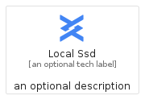
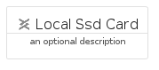
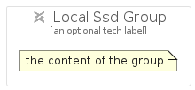

# LocalSsd


```text
gcp/Item/LocalSsd
```

```text
include('gcp/Item/LocalSsd')
```


| Illustration | LocalSsd | LocalSsdCard | LocalSsdGroup |
| :---: | :---: | :---: | :---: |
|  |  |  |  |


## Sprites
The item provides the following sriptes:

- `<$LocalSsdXs>`
- `<$LocalSsdSm>`
- `<$LocalSsdMd>`
- `<$LocalSsdLg>`


## LocalSsd

### Load remotely
```plantuml
@startuml
' configures the library
!global $LIB_BASE_LOCATION="https://raw.githubusercontent.com/tmorin/plantuml-libs/master/distribution"

' loads the library's bootstrap
!include $LIB_BASE_LOCATION/bootstrap.puml

' loads the package bootstrap
include('gcp/bootstrap')

' loads the Item which embeds the element LocalSsd
include('gcp/Item/LocalSsd')

' renders the element
LocalSsd('LocalSsd', 'Local Ssd', 'an optional tech label', 'an optional description')
@enduml
```

### Load locally
```plantuml
@startuml
' configures the library
!global $INCLUSION_MODE="local"
!global $LIB_BASE_LOCATION="../.."

' loads the library's bootstrap
!include $LIB_BASE_LOCATION/bootstrap.puml

' loads the package bootstrap
include('gcp/bootstrap')

' loads the Item which embeds the element LocalSsd
include('gcp/Item/LocalSsd')

' renders the element
LocalSsd('LocalSsd', 'Local Ssd', 'an optional tech label', 'an optional description')
@enduml
```

## LocalSsdCard

### Load remotely
```plantuml
@startuml
' configures the library
!global $LIB_BASE_LOCATION="https://raw.githubusercontent.com/tmorin/plantuml-libs/master/distribution"

' loads the library's bootstrap
!include $LIB_BASE_LOCATION/bootstrap.puml

' loads the package bootstrap
include('gcp/bootstrap')

' loads the Item which embeds the element LocalSsdCard
include('gcp/Item/LocalSsd')

' renders the element
LocalSsdCard('LocalSsdCard', 'Local Ssd Card', 'an optional description')
@enduml
```

### Load locally
```plantuml
@startuml
' configures the library
!global $INCLUSION_MODE="local"
!global $LIB_BASE_LOCATION="../.."

' loads the library's bootstrap
!include $LIB_BASE_LOCATION/bootstrap.puml

' loads the package bootstrap
include('gcp/bootstrap')

' loads the Item which embeds the element LocalSsdCard
include('gcp/Item/LocalSsd')

' renders the element
LocalSsdCard('LocalSsdCard', 'Local Ssd Card', 'an optional description')
@enduml
```

## LocalSsdGroup

### Load remotely
```plantuml
@startuml
' configures the library
!global $LIB_BASE_LOCATION="https://raw.githubusercontent.com/tmorin/plantuml-libs/master/distribution"

' loads the library's bootstrap
!include $LIB_BASE_LOCATION/bootstrap.puml

' loads the package bootstrap
include('gcp/bootstrap')

' loads the Item which embeds the element LocalSsdGroup
include('gcp/Item/LocalSsd')

' renders the element
LocalSsdGroup('LocalSsdGroup', 'Local Ssd Group', 'an optional tech label') {
    note as note
        the content of the group
    end note
}
@enduml
```

### Load locally
```plantuml
@startuml
' configures the library
!global $INCLUSION_MODE="local"
!global $LIB_BASE_LOCATION="../.."

' loads the library's bootstrap
!include $LIB_BASE_LOCATION/bootstrap.puml

' loads the package bootstrap
include('gcp/bootstrap')

' loads the Item which embeds the element LocalSsdGroup
include('gcp/Item/LocalSsd')

' renders the element
LocalSsdGroup('LocalSsdGroup', 'Local Ssd Group', 'an optional tech label') {
    note as note
        the content of the group
    end note
}
@enduml
```

