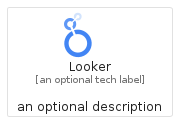
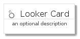
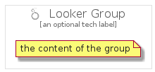

# Looker


```text
gcp/Item/Looker
```

```text
include('gcp/Item/Looker')
```


| Illustration | Looker | LookerCard | LookerGroup |
| :---: | :---: | :---: | :---: |
|  |  |  |  |


## Looker

### Load remotely
```plantuml
@startuml
' configures the library
!global $LIB_BASE_LOCATION="https://raw.githubusercontent.com/tmorin/plantuml-libs/master/distribution"

' loads the library's bootstrap
!include $LIB_BASE_LOCATION/bootstrap.puml

' loads the package bootstrap
include('gcp/bootstrap')

' loads the Item which embeds the element Looker
include('gcp/Item/Looker')

' renders the element
Looker('Looker', 'Looker', 'an optional tech label', 'an optional description')
@enduml
```

### Load locally
```plantuml
@startuml
' configures the library
!global $INCLUSION_MODE="local"
!global $LIB_BASE_LOCATION="../.."

' loads the library's bootstrap
!include $LIB_BASE_LOCATION/bootstrap.puml

' loads the package bootstrap
include('gcp/bootstrap')

' loads the Item which embeds the element Looker
include('gcp/Item/Looker')

' renders the element
Looker('Looker', 'Looker', 'an optional tech label', 'an optional description')
@enduml
```

## LookerCard

### Load remotely
```plantuml
@startuml
' configures the library
!global $LIB_BASE_LOCATION="https://raw.githubusercontent.com/tmorin/plantuml-libs/master/distribution"

' loads the library's bootstrap
!include $LIB_BASE_LOCATION/bootstrap.puml

' loads the package bootstrap
include('gcp/bootstrap')

' loads the Item which embeds the element LookerCard
include('gcp/Item/Looker')

' renders the element
LookerCard('LookerCard', 'Looker Card', 'an optional description')
@enduml
```

### Load locally
```plantuml
@startuml
' configures the library
!global $INCLUSION_MODE="local"
!global $LIB_BASE_LOCATION="../.."

' loads the library's bootstrap
!include $LIB_BASE_LOCATION/bootstrap.puml

' loads the package bootstrap
include('gcp/bootstrap')

' loads the Item which embeds the element LookerCard
include('gcp/Item/Looker')

' renders the element
LookerCard('LookerCard', 'Looker Card', 'an optional description')
@enduml
```

## LookerGroup

### Load remotely
```plantuml
@startuml
' configures the library
!global $LIB_BASE_LOCATION="https://raw.githubusercontent.com/tmorin/plantuml-libs/master/distribution"

' loads the library's bootstrap
!include $LIB_BASE_LOCATION/bootstrap.puml

' loads the package bootstrap
include('gcp/bootstrap')

' loads the Item which embeds the element LookerGroup
include('gcp/Item/Looker')

' renders the element
LookerGroup('LookerGroup', 'Looker Group', 'an optional tech label') {
    note as note
        the content of the group
    end note
}
@enduml
```

### Load locally
```plantuml
@startuml
' configures the library
!global $INCLUSION_MODE="local"
!global $LIB_BASE_LOCATION="../.."

' loads the library's bootstrap
!include $LIB_BASE_LOCATION/bootstrap.puml

' loads the package bootstrap
include('gcp/bootstrap')

' loads the Item which embeds the element LookerGroup
include('gcp/Item/Looker')

' renders the element
LookerGroup('LookerGroup', 'Looker Group', 'an optional tech label') {
    note as note
        the content of the group
    end note
}
@enduml
```

