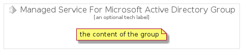

# ManagedServiceForMicrosoftActiveDirectory


```text
gcp/Item/ManagedServiceForMicrosoftActiveDirectory
```

```text
include('gcp/Item/ManagedServiceForMicrosoftActiveDirectory')
```


| Illustration | ManagedServiceForMicrosoftActiveDirectory | ManagedServiceForMicrosoftActiveDirectoryCard | ManagedServiceForMicrosoftActiveDirectoryGroup |
| :---: | :---: | :---: | :---: |
|  |  |  |  |


## ManagedServiceForMicrosoftActiveDirectory

### Load remotely
```plantuml
@startuml
' configures the library
!global $LIB_BASE_LOCATION="https://raw.githubusercontent.com/tmorin/plantuml-libs/master/distribution"

' loads the library's bootstrap
!include $LIB_BASE_LOCATION/bootstrap.puml

' loads the package bootstrap
include('gcp/bootstrap')

' loads the Item which embeds the element ManagedServiceForMicrosoftActiveDirectory
include('gcp/Item/ManagedServiceForMicrosoftActiveDirectory')

' renders the element
ManagedServiceForMicrosoftActiveDirectory('ManagedServiceForMicrosoftActiveDirectory', 'Managed Service For Microsoft Active Directory', 'an optional tech label')
@enduml
```

### Load locally
```plantuml
@startuml
' configures the library
!global $INCLUSION_MODE="local"
!global $LIB_BASE_LOCATION="../.."

' loads the library's bootstrap
!include $LIB_BASE_LOCATION/bootstrap.puml

' loads the package bootstrap
include('gcp/bootstrap')

' loads the Item which embeds the element ManagedServiceForMicrosoftActiveDirectory
include('gcp/Item/ManagedServiceForMicrosoftActiveDirectory')

' renders the element
ManagedServiceForMicrosoftActiveDirectory('ManagedServiceForMicrosoftActiveDirectory', 'Managed Service For Microsoft Active Directory', 'an optional tech label')
@enduml
```

## ManagedServiceForMicrosoftActiveDirectoryCard

### Load remotely
```plantuml
@startuml
' configures the library
!global $LIB_BASE_LOCATION="https://raw.githubusercontent.com/tmorin/plantuml-libs/master/distribution"

' loads the library's bootstrap
!include $LIB_BASE_LOCATION/bootstrap.puml

' loads the package bootstrap
include('gcp/bootstrap')

' loads the Item which embeds the element ManagedServiceForMicrosoftActiveDirectoryCard
include('gcp/Item/ManagedServiceForMicrosoftActiveDirectory')

' renders the element
ManagedServiceForMicrosoftActiveDirectoryCard('ManagedServiceForMicrosoftActiveDirectoryCard', 'Managed Service For Microsoft Active Directory Card', 'an optional description')
@enduml
```

### Load locally
```plantuml
@startuml
' configures the library
!global $INCLUSION_MODE="local"
!global $LIB_BASE_LOCATION="../.."

' loads the library's bootstrap
!include $LIB_BASE_LOCATION/bootstrap.puml

' loads the package bootstrap
include('gcp/bootstrap')

' loads the Item which embeds the element ManagedServiceForMicrosoftActiveDirectoryCard
include('gcp/Item/ManagedServiceForMicrosoftActiveDirectory')

' renders the element
ManagedServiceForMicrosoftActiveDirectoryCard('ManagedServiceForMicrosoftActiveDirectoryCard', 'Managed Service For Microsoft Active Directory Card', 'an optional description')
@enduml
```

## ManagedServiceForMicrosoftActiveDirectoryGroup

### Load remotely
```plantuml
@startuml
' configures the library
!global $LIB_BASE_LOCATION="https://raw.githubusercontent.com/tmorin/plantuml-libs/master/distribution"

' loads the library's bootstrap
!include $LIB_BASE_LOCATION/bootstrap.puml

' loads the package bootstrap
include('gcp/bootstrap')

' loads the Item which embeds the element ManagedServiceForMicrosoftActiveDirectoryGroup
include('gcp/Item/ManagedServiceForMicrosoftActiveDirectory')

' renders the element
ManagedServiceForMicrosoftActiveDirectoryGroup('ManagedServiceForMicrosoftActiveDirectoryGroup', 'Managed Service For Microsoft Active Directory Group', 'an optional tech label') {
    note as note
        the content of the group
    end note
}
@enduml
```

### Load locally
```plantuml
@startuml
' configures the library
!global $INCLUSION_MODE="local"
!global $LIB_BASE_LOCATION="../.."

' loads the library's bootstrap
!include $LIB_BASE_LOCATION/bootstrap.puml

' loads the package bootstrap
include('gcp/bootstrap')

' loads the Item which embeds the element ManagedServiceForMicrosoftActiveDirectoryGroup
include('gcp/Item/ManagedServiceForMicrosoftActiveDirectory')

' renders the element
ManagedServiceForMicrosoftActiveDirectoryGroup('ManagedServiceForMicrosoftActiveDirectoryGroup', 'Managed Service For Microsoft Active Directory Group', 'an optional tech label') {
    note as note
        the content of the group
    end note
}
@enduml
```

