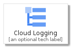
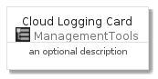
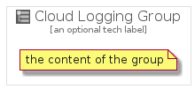

# CloudLogging


```text
gcp/Item/ManagementTools/CloudLogging
```

```text
include('gcp/Item/ManagementTools/CloudLogging')
```


| Illustration | CloudLogging | CloudLoggingCard | CloudLoggingGroup |
| :---: | :---: | :---: | :---: |
|  |  |  |  |


## CloudLogging

### Load remotely
```plantuml
@startuml
' configures the library
!global $LIB_BASE_LOCATION="https://raw.githubusercontent.com/tmorin/plantuml-libs/master/distribution"

' loads the library's bootstrap
!include $LIB_BASE_LOCATION/bootstrap.puml

' loads the package bootstrap
include('gcp/bootstrap')

' loads the Item which embeds the element CloudLogging
include('gcp/Item/ManagementTools/CloudLogging')

' renders the element
CloudLogging('CloudLogging', 'Cloud Logging', 'an optional tech label')
@enduml
```

### Load locally
```plantuml
@startuml
' configures the library
!global $INCLUSION_MODE="local"
!global $LIB_BASE_LOCATION="../../.."

' loads the library's bootstrap
!include $LIB_BASE_LOCATION/bootstrap.puml

' loads the package bootstrap
include('gcp/bootstrap')

' loads the Item which embeds the element CloudLogging
include('gcp/Item/ManagementTools/CloudLogging')

' renders the element
CloudLogging('CloudLogging', 'Cloud Logging', 'an optional tech label')
@enduml
```

## CloudLoggingCard

### Load remotely
```plantuml
@startuml
' configures the library
!global $LIB_BASE_LOCATION="https://raw.githubusercontent.com/tmorin/plantuml-libs/master/distribution"

' loads the library's bootstrap
!include $LIB_BASE_LOCATION/bootstrap.puml

' loads the package bootstrap
include('gcp/bootstrap')

' loads the Item which embeds the element CloudLoggingCard
include('gcp/Item/ManagementTools/CloudLogging')

' renders the element
CloudLoggingCard('CloudLoggingCard', 'Cloud Logging Card', 'an optional description')
@enduml
```

### Load locally
```plantuml
@startuml
' configures the library
!global $INCLUSION_MODE="local"
!global $LIB_BASE_LOCATION="../../.."

' loads the library's bootstrap
!include $LIB_BASE_LOCATION/bootstrap.puml

' loads the package bootstrap
include('gcp/bootstrap')

' loads the Item which embeds the element CloudLoggingCard
include('gcp/Item/ManagementTools/CloudLogging')

' renders the element
CloudLoggingCard('CloudLoggingCard', 'Cloud Logging Card', 'an optional description')
@enduml
```

## CloudLoggingGroup

### Load remotely
```plantuml
@startuml
' configures the library
!global $LIB_BASE_LOCATION="https://raw.githubusercontent.com/tmorin/plantuml-libs/master/distribution"

' loads the library's bootstrap
!include $LIB_BASE_LOCATION/bootstrap.puml

' loads the package bootstrap
include('gcp/bootstrap')

' loads the Item which embeds the element CloudLoggingGroup
include('gcp/Item/ManagementTools/CloudLogging')

' renders the element
CloudLoggingGroup('CloudLoggingGroup', 'Cloud Logging Group', 'an optional tech label') {
    note as note
        the content of the group
    end note
}
@enduml
```

### Load locally
```plantuml
@startuml
' configures the library
!global $INCLUSION_MODE="local"
!global $LIB_BASE_LOCATION="../../.."

' loads the library's bootstrap
!include $LIB_BASE_LOCATION/bootstrap.puml

' loads the package bootstrap
include('gcp/bootstrap')

' loads the Item which embeds the element CloudLoggingGroup
include('gcp/Item/ManagementTools/CloudLogging')

' renders the element
CloudLoggingGroup('CloudLoggingGroup', 'Cloud Logging Group', 'an optional tech label') {
    note as note
        the content of the group
    end note
}
@enduml
```

