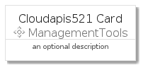
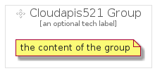

# Cloudapis521


```text
gcp/Item/ManagementTools/Cloudapis521
```

```text
include('gcp/Item/ManagementTools/Cloudapis521')
```


| Illustration | Cloudapis521 | Cloudapis521Card | Cloudapis521Group |
| :---: | :---: | :---: | :---: |
|  |  |  |  |


## Cloudapis521

### Load remotely
```plantuml
@startuml
' configures the library
!global $LIB_BASE_LOCATION="https://github.com/tmorin/plantuml-libs/distribution"

' loads the library's bootstrap
!include $LIB_BASE_LOCATION/bootstrap.puml

' loads the package bootstrap
include('gcp/bootstrap')

' loads the Item which embeds the element Cloudapis521
include('gcp/Item/ManagementTools/Cloudapis521')

' renders the element
Cloudapis521('Cloudapis521', 'Cloudapis521', 'an optional tech label')
@enduml
```

### Load locally
```plantuml
@startuml
' configures the library
!global $INCLUSION_MODE="local"
!global $LIB_BASE_LOCATION="../../.."

' loads the library's bootstrap
!include $LIB_BASE_LOCATION/bootstrap.puml

' loads the package bootstrap
include('gcp/bootstrap')

' loads the Item which embeds the element Cloudapis521
include('gcp/Item/ManagementTools/Cloudapis521')

' renders the element
Cloudapis521('Cloudapis521', 'Cloudapis521', 'an optional tech label')
@enduml
```

## Cloudapis521Card

### Load remotely
```plantuml
@startuml
' configures the library
!global $LIB_BASE_LOCATION="https://github.com/tmorin/plantuml-libs/distribution"

' loads the library's bootstrap
!include $LIB_BASE_LOCATION/bootstrap.puml

' loads the package bootstrap
include('gcp/bootstrap')

' loads the Item which embeds the element Cloudapis521Card
include('gcp/Item/ManagementTools/Cloudapis521')

' renders the element
Cloudapis521Card('Cloudapis521Card', 'Cloudapis521 Card', 'an optional description')
@enduml
```

### Load locally
```plantuml
@startuml
' configures the library
!global $INCLUSION_MODE="local"
!global $LIB_BASE_LOCATION="../../.."

' loads the library's bootstrap
!include $LIB_BASE_LOCATION/bootstrap.puml

' loads the package bootstrap
include('gcp/bootstrap')

' loads the Item which embeds the element Cloudapis521Card
include('gcp/Item/ManagementTools/Cloudapis521')

' renders the element
Cloudapis521Card('Cloudapis521Card', 'Cloudapis521 Card', 'an optional description')
@enduml
```

## Cloudapis521Group

### Load remotely
```plantuml
@startuml
' configures the library
!global $LIB_BASE_LOCATION="https://github.com/tmorin/plantuml-libs/distribution"

' loads the library's bootstrap
!include $LIB_BASE_LOCATION/bootstrap.puml

' loads the package bootstrap
include('gcp/bootstrap')

' loads the Item which embeds the element Cloudapis521Group
include('gcp/Item/ManagementTools/Cloudapis521')

' renders the element
Cloudapis521Group('Cloudapis521Group', 'Cloudapis521 Group', 'an optional tech label') {
    note as note
        the content of the group
    end note
}
@enduml
```

### Load locally
```plantuml
@startuml
' configures the library
!global $INCLUSION_MODE="local"
!global $LIB_BASE_LOCATION="../../.."

' loads the library's bootstrap
!include $LIB_BASE_LOCATION/bootstrap.puml

' loads the package bootstrap
include('gcp/bootstrap')

' loads the Item which embeds the element Cloudapis521Group
include('gcp/Item/ManagementTools/Cloudapis521')

' renders the element
Cloudapis521Group('Cloudapis521Group', 'Cloudapis521 Group', 'an optional tech label') {
    note as note
        the content of the group
    end note
}
@enduml
```

