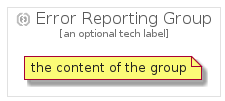

# ErrorReporting


```text
gcp/Item/ManagementTools/ErrorReporting
```

```text
include('gcp/Item/ManagementTools/ErrorReporting')
```


| Illustration | ErrorReporting | ErrorReportingCard | ErrorReportingGroup |
| :---: | :---: | :---: | :---: |
|  |  |  |  |


## ErrorReporting

### Load remotely
```plantuml
@startuml
' configures the library
!global $LIB_BASE_LOCATION="https://raw.githubusercontent.com/tmorin/plantuml-libs/master/distribution"

' loads the library's bootstrap
!include $LIB_BASE_LOCATION/bootstrap.puml

' loads the package bootstrap
include('gcp/bootstrap')

' loads the Item which embeds the element ErrorReporting
include('gcp/Item/ManagementTools/ErrorReporting')

' renders the element
ErrorReporting('ErrorReporting', 'Error Reporting', 'an optional tech label')
@enduml
```

### Load locally
```plantuml
@startuml
' configures the library
!global $INCLUSION_MODE="local"
!global $LIB_BASE_LOCATION="../../.."

' loads the library's bootstrap
!include $LIB_BASE_LOCATION/bootstrap.puml

' loads the package bootstrap
include('gcp/bootstrap')

' loads the Item which embeds the element ErrorReporting
include('gcp/Item/ManagementTools/ErrorReporting')

' renders the element
ErrorReporting('ErrorReporting', 'Error Reporting', 'an optional tech label')
@enduml
```

## ErrorReportingCard

### Load remotely
```plantuml
@startuml
' configures the library
!global $LIB_BASE_LOCATION="https://raw.githubusercontent.com/tmorin/plantuml-libs/master/distribution"

' loads the library's bootstrap
!include $LIB_BASE_LOCATION/bootstrap.puml

' loads the package bootstrap
include('gcp/bootstrap')

' loads the Item which embeds the element ErrorReportingCard
include('gcp/Item/ManagementTools/ErrorReporting')

' renders the element
ErrorReportingCard('ErrorReportingCard', 'Error Reporting Card', 'an optional description')
@enduml
```

### Load locally
```plantuml
@startuml
' configures the library
!global $INCLUSION_MODE="local"
!global $LIB_BASE_LOCATION="../../.."

' loads the library's bootstrap
!include $LIB_BASE_LOCATION/bootstrap.puml

' loads the package bootstrap
include('gcp/bootstrap')

' loads the Item which embeds the element ErrorReportingCard
include('gcp/Item/ManagementTools/ErrorReporting')

' renders the element
ErrorReportingCard('ErrorReportingCard', 'Error Reporting Card', 'an optional description')
@enduml
```

## ErrorReportingGroup

### Load remotely
```plantuml
@startuml
' configures the library
!global $LIB_BASE_LOCATION="https://raw.githubusercontent.com/tmorin/plantuml-libs/master/distribution"

' loads the library's bootstrap
!include $LIB_BASE_LOCATION/bootstrap.puml

' loads the package bootstrap
include('gcp/bootstrap')

' loads the Item which embeds the element ErrorReportingGroup
include('gcp/Item/ManagementTools/ErrorReporting')

' renders the element
ErrorReportingGroup('ErrorReportingGroup', 'Error Reporting Group', 'an optional tech label') {
    note as note
        the content of the group
    end note
}
@enduml
```

### Load locally
```plantuml
@startuml
' configures the library
!global $INCLUSION_MODE="local"
!global $LIB_BASE_LOCATION="../../.."

' loads the library's bootstrap
!include $LIB_BASE_LOCATION/bootstrap.puml

' loads the package bootstrap
include('gcp/bootstrap')

' loads the Item which embeds the element ErrorReportingGroup
include('gcp/Item/ManagementTools/ErrorReporting')

' renders the element
ErrorReportingGroup('ErrorReportingGroup', 'Error Reporting Group', 'an optional tech label') {
    note as note
        the content of the group
    end note
}
@enduml
```

