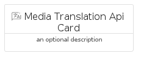
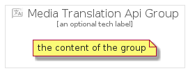

# MediaTranslationApi


```text
gcp/Item/MediaTranslationApi
```

```text
include('gcp/Item/MediaTranslationApi')
```


| Illustration | MediaTranslationApi | MediaTranslationApiCard | MediaTranslationApiGroup |
| :---: | :---: | :---: | :---: |
|  |  |  |  |


## Sprites
The item provides the following sriptes:

- `<$MediaTranslationApiXs>`
- `<$MediaTranslationApiSm>`
- `<$MediaTranslationApiMd>`
- `<$MediaTranslationApiLg>`


## MediaTranslationApi

### Load remotely
```plantuml
@startuml
' configures the library
!global $LIB_BASE_LOCATION="https://raw.githubusercontent.com/tmorin/plantuml-libs/master/distribution"

' loads the library's bootstrap
!include $LIB_BASE_LOCATION/bootstrap.puml

' loads the package bootstrap
include('gcp/bootstrap')

' loads the Item which embeds the element MediaTranslationApi
include('gcp/Item/MediaTranslationApi')

' renders the element
MediaTranslationApi('MediaTranslationApi', 'Media Translation Api', 'an optional tech label', 'an optional description')
@enduml
```

### Load locally
```plantuml
@startuml
' configures the library
!global $INCLUSION_MODE="local"
!global $LIB_BASE_LOCATION="../.."

' loads the library's bootstrap
!include $LIB_BASE_LOCATION/bootstrap.puml

' loads the package bootstrap
include('gcp/bootstrap')

' loads the Item which embeds the element MediaTranslationApi
include('gcp/Item/MediaTranslationApi')

' renders the element
MediaTranslationApi('MediaTranslationApi', 'Media Translation Api', 'an optional tech label', 'an optional description')
@enduml
```

## MediaTranslationApiCard

### Load remotely
```plantuml
@startuml
' configures the library
!global $LIB_BASE_LOCATION="https://raw.githubusercontent.com/tmorin/plantuml-libs/master/distribution"

' loads the library's bootstrap
!include $LIB_BASE_LOCATION/bootstrap.puml

' loads the package bootstrap
include('gcp/bootstrap')

' loads the Item which embeds the element MediaTranslationApiCard
include('gcp/Item/MediaTranslationApi')

' renders the element
MediaTranslationApiCard('MediaTranslationApiCard', 'Media Translation Api Card', 'an optional description')
@enduml
```

### Load locally
```plantuml
@startuml
' configures the library
!global $INCLUSION_MODE="local"
!global $LIB_BASE_LOCATION="../.."

' loads the library's bootstrap
!include $LIB_BASE_LOCATION/bootstrap.puml

' loads the package bootstrap
include('gcp/bootstrap')

' loads the Item which embeds the element MediaTranslationApiCard
include('gcp/Item/MediaTranslationApi')

' renders the element
MediaTranslationApiCard('MediaTranslationApiCard', 'Media Translation Api Card', 'an optional description')
@enduml
```

## MediaTranslationApiGroup

### Load remotely
```plantuml
@startuml
' configures the library
!global $LIB_BASE_LOCATION="https://raw.githubusercontent.com/tmorin/plantuml-libs/master/distribution"

' loads the library's bootstrap
!include $LIB_BASE_LOCATION/bootstrap.puml

' loads the package bootstrap
include('gcp/bootstrap')

' loads the Item which embeds the element MediaTranslationApiGroup
include('gcp/Item/MediaTranslationApi')

' renders the element
MediaTranslationApiGroup('MediaTranslationApiGroup', 'Media Translation Api Group', 'an optional tech label') {
    note as note
        the content of the group
    end note
}
@enduml
```

### Load locally
```plantuml
@startuml
' configures the library
!global $INCLUSION_MODE="local"
!global $LIB_BASE_LOCATION="../.."

' loads the library's bootstrap
!include $LIB_BASE_LOCATION/bootstrap.puml

' loads the package bootstrap
include('gcp/bootstrap')

' loads the Item which embeds the element MediaTranslationApiGroup
include('gcp/Item/MediaTranslationApi')

' renders the element
MediaTranslationApiGroup('MediaTranslationApiGroup', 'Media Translation Api Group', 'an optional tech label') {
    note as note
        the content of the group
    end note
}
@enduml
```

