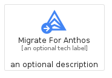
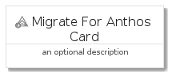
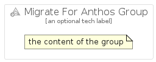

# MigrateForAnthos


```text
gcp/Item/MigrateForAnthos
```

```text
include('gcp/Item/MigrateForAnthos')
```


| Illustration | MigrateForAnthos | MigrateForAnthosCard | MigrateForAnthosGroup |
| :---: | :---: | :---: | :---: |
|  |  |  |  |


## MigrateForAnthos

### Load remotely
```plantuml
@startuml
' configures the library
!global $LIB_BASE_LOCATION="https://raw.githubusercontent.com/tmorin/plantuml-libs/master/distribution"

' loads the library's bootstrap
!include $LIB_BASE_LOCATION/bootstrap.puml

' loads the package bootstrap
include('gcp/bootstrap')

' loads the Item which embeds the element MigrateForAnthos
include('gcp/Item/MigrateForAnthos')

' renders the element
MigrateForAnthos('MigrateForAnthos', 'Migrate For Anthos', 'an optional tech label')
@enduml
```

### Load locally
```plantuml
@startuml
' configures the library
!global $INCLUSION_MODE="local"
!global $LIB_BASE_LOCATION="../.."

' loads the library's bootstrap
!include $LIB_BASE_LOCATION/bootstrap.puml

' loads the package bootstrap
include('gcp/bootstrap')

' loads the Item which embeds the element MigrateForAnthos
include('gcp/Item/MigrateForAnthos')

' renders the element
MigrateForAnthos('MigrateForAnthos', 'Migrate For Anthos', 'an optional tech label')
@enduml
```

## MigrateForAnthosCard

### Load remotely
```plantuml
@startuml
' configures the library
!global $LIB_BASE_LOCATION="https://raw.githubusercontent.com/tmorin/plantuml-libs/master/distribution"

' loads the library's bootstrap
!include $LIB_BASE_LOCATION/bootstrap.puml

' loads the package bootstrap
include('gcp/bootstrap')

' loads the Item which embeds the element MigrateForAnthosCard
include('gcp/Item/MigrateForAnthos')

' renders the element
MigrateForAnthosCard('MigrateForAnthosCard', 'Migrate For Anthos Card', 'an optional description')
@enduml
```

### Load locally
```plantuml
@startuml
' configures the library
!global $INCLUSION_MODE="local"
!global $LIB_BASE_LOCATION="../.."

' loads the library's bootstrap
!include $LIB_BASE_LOCATION/bootstrap.puml

' loads the package bootstrap
include('gcp/bootstrap')

' loads the Item which embeds the element MigrateForAnthosCard
include('gcp/Item/MigrateForAnthos')

' renders the element
MigrateForAnthosCard('MigrateForAnthosCard', 'Migrate For Anthos Card', 'an optional description')
@enduml
```

## MigrateForAnthosGroup

### Load remotely
```plantuml
@startuml
' configures the library
!global $LIB_BASE_LOCATION="https://raw.githubusercontent.com/tmorin/plantuml-libs/master/distribution"

' loads the library's bootstrap
!include $LIB_BASE_LOCATION/bootstrap.puml

' loads the package bootstrap
include('gcp/bootstrap')

' loads the Item which embeds the element MigrateForAnthosGroup
include('gcp/Item/MigrateForAnthos')

' renders the element
MigrateForAnthosGroup('MigrateForAnthosGroup', 'Migrate For Anthos Group', 'an optional tech label') {
    note as note
        the content of the group
    end note
}
@enduml
```

### Load locally
```plantuml
@startuml
' configures the library
!global $INCLUSION_MODE="local"
!global $LIB_BASE_LOCATION="../.."

' loads the library's bootstrap
!include $LIB_BASE_LOCATION/bootstrap.puml

' loads the package bootstrap
include('gcp/bootstrap')

' loads the Item which embeds the element MigrateForAnthosGroup
include('gcp/Item/MigrateForAnthos')

' renders the element
MigrateForAnthosGroup('MigrateForAnthosGroup', 'Migrate For Anthos Group', 'an optional tech label') {
    note as note
        the content of the group
    end note
}
@enduml
```

