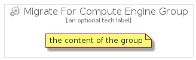

# MigrateForComputeEngine


```text
gcp/Item/MigrateForComputeEngine
```

```text
include('gcp/Item/MigrateForComputeEngine')
```


| Illustration | MigrateForComputeEngine | MigrateForComputeEngineCard | MigrateForComputeEngineGroup |
| :---: | :---: | :---: | :---: |
|  |  |  |  |


## MigrateForComputeEngine

### Load remotely
```plantuml
@startuml
' configures the library
!global $LIB_BASE_LOCATION="https://raw.githubusercontent.com/tmorin/plantuml-libs/master/distribution"

' loads the library's bootstrap
!include $LIB_BASE_LOCATION/bootstrap.puml

' loads the package bootstrap
include('gcp/bootstrap')

' loads the Item which embeds the element MigrateForComputeEngine
include('gcp/Item/MigrateForComputeEngine')

' renders the element
MigrateForComputeEngine('MigrateForComputeEngine', 'Migrate For Compute Engine', 'an optional tech label')
@enduml
```

### Load locally
```plantuml
@startuml
' configures the library
!global $INCLUSION_MODE="local"
!global $LIB_BASE_LOCATION="../.."

' loads the library's bootstrap
!include $LIB_BASE_LOCATION/bootstrap.puml

' loads the package bootstrap
include('gcp/bootstrap')

' loads the Item which embeds the element MigrateForComputeEngine
include('gcp/Item/MigrateForComputeEngine')

' renders the element
MigrateForComputeEngine('MigrateForComputeEngine', 'Migrate For Compute Engine', 'an optional tech label')
@enduml
```

## MigrateForComputeEngineCard

### Load remotely
```plantuml
@startuml
' configures the library
!global $LIB_BASE_LOCATION="https://raw.githubusercontent.com/tmorin/plantuml-libs/master/distribution"

' loads the library's bootstrap
!include $LIB_BASE_LOCATION/bootstrap.puml

' loads the package bootstrap
include('gcp/bootstrap')

' loads the Item which embeds the element MigrateForComputeEngineCard
include('gcp/Item/MigrateForComputeEngine')

' renders the element
MigrateForComputeEngineCard('MigrateForComputeEngineCard', 'Migrate For Compute Engine Card', 'an optional description')
@enduml
```

### Load locally
```plantuml
@startuml
' configures the library
!global $INCLUSION_MODE="local"
!global $LIB_BASE_LOCATION="../.."

' loads the library's bootstrap
!include $LIB_BASE_LOCATION/bootstrap.puml

' loads the package bootstrap
include('gcp/bootstrap')

' loads the Item which embeds the element MigrateForComputeEngineCard
include('gcp/Item/MigrateForComputeEngine')

' renders the element
MigrateForComputeEngineCard('MigrateForComputeEngineCard', 'Migrate For Compute Engine Card', 'an optional description')
@enduml
```

## MigrateForComputeEngineGroup

### Load remotely
```plantuml
@startuml
' configures the library
!global $LIB_BASE_LOCATION="https://raw.githubusercontent.com/tmorin/plantuml-libs/master/distribution"

' loads the library's bootstrap
!include $LIB_BASE_LOCATION/bootstrap.puml

' loads the package bootstrap
include('gcp/bootstrap')

' loads the Item which embeds the element MigrateForComputeEngineGroup
include('gcp/Item/MigrateForComputeEngine')

' renders the element
MigrateForComputeEngineGroup('MigrateForComputeEngineGroup', 'Migrate For Compute Engine Group', 'an optional tech label') {
    note as note
        the content of the group
    end note
}
@enduml
```

### Load locally
```plantuml
@startuml
' configures the library
!global $INCLUSION_MODE="local"
!global $LIB_BASE_LOCATION="../.."

' loads the library's bootstrap
!include $LIB_BASE_LOCATION/bootstrap.puml

' loads the package bootstrap
include('gcp/bootstrap')

' loads the Item which embeds the element MigrateForComputeEngineGroup
include('gcp/Item/MigrateForComputeEngine')

' renders the element
MigrateForComputeEngineGroup('MigrateForComputeEngineGroup', 'Migrate For Compute Engine Group', 'an optional tech label') {
    note as note
        the content of the group
    end note
}
@enduml
```

