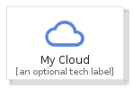
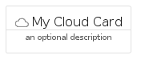
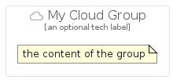

# MyCloud


```text
gcp/Item/MyCloud
```

```text
include('gcp/Item/MyCloud')
```


| Illustration | MyCloud | MyCloudCard | MyCloudGroup |
| :---: | :---: | :---: | :---: |
|  |  |  |  |


## MyCloud

### Load remotely
```plantuml
@startuml
' configures the library
!global $LIB_BASE_LOCATION="https://raw.githubusercontent.com/tmorin/plantuml-libs/master/distribution"

' loads the library's bootstrap
!include $LIB_BASE_LOCATION/bootstrap.puml

' loads the package bootstrap
include('gcp/bootstrap')

' loads the Item which embeds the element MyCloud
include('gcp/Item/MyCloud')

' renders the element
MyCloud('MyCloud', 'My Cloud', 'an optional tech label')
@enduml
```

### Load locally
```plantuml
@startuml
' configures the library
!global $INCLUSION_MODE="local"
!global $LIB_BASE_LOCATION="../.."

' loads the library's bootstrap
!include $LIB_BASE_LOCATION/bootstrap.puml

' loads the package bootstrap
include('gcp/bootstrap')

' loads the Item which embeds the element MyCloud
include('gcp/Item/MyCloud')

' renders the element
MyCloud('MyCloud', 'My Cloud', 'an optional tech label')
@enduml
```

## MyCloudCard

### Load remotely
```plantuml
@startuml
' configures the library
!global $LIB_BASE_LOCATION="https://raw.githubusercontent.com/tmorin/plantuml-libs/master/distribution"

' loads the library's bootstrap
!include $LIB_BASE_LOCATION/bootstrap.puml

' loads the package bootstrap
include('gcp/bootstrap')

' loads the Item which embeds the element MyCloudCard
include('gcp/Item/MyCloud')

' renders the element
MyCloudCard('MyCloudCard', 'My Cloud Card', 'an optional description')
@enduml
```

### Load locally
```plantuml
@startuml
' configures the library
!global $INCLUSION_MODE="local"
!global $LIB_BASE_LOCATION="../.."

' loads the library's bootstrap
!include $LIB_BASE_LOCATION/bootstrap.puml

' loads the package bootstrap
include('gcp/bootstrap')

' loads the Item which embeds the element MyCloudCard
include('gcp/Item/MyCloud')

' renders the element
MyCloudCard('MyCloudCard', 'My Cloud Card', 'an optional description')
@enduml
```

## MyCloudGroup

### Load remotely
```plantuml
@startuml
' configures the library
!global $LIB_BASE_LOCATION="https://raw.githubusercontent.com/tmorin/plantuml-libs/master/distribution"

' loads the library's bootstrap
!include $LIB_BASE_LOCATION/bootstrap.puml

' loads the package bootstrap
include('gcp/bootstrap')

' loads the Item which embeds the element MyCloudGroup
include('gcp/Item/MyCloud')

' renders the element
MyCloudGroup('MyCloudGroup', 'My Cloud Group', 'an optional tech label') {
    note as note
        the content of the group
    end note
}
@enduml
```

### Load locally
```plantuml
@startuml
' configures the library
!global $INCLUSION_MODE="local"
!global $LIB_BASE_LOCATION="../.."

' loads the library's bootstrap
!include $LIB_BASE_LOCATION/bootstrap.puml

' loads the package bootstrap
include('gcp/bootstrap')

' loads the Item which embeds the element MyCloudGroup
include('gcp/Item/MyCloud')

' renders the element
MyCloudGroup('MyCloudGroup', 'My Cloud Group', 'an optional tech label') {
    note as note
        the content of the group
    end note
}
@enduml
```

