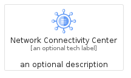
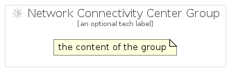

# NetworkConnectivityCenter


```text
gcp/Item/NetworkConnectivityCenter
```

```text
include('gcp/Item/NetworkConnectivityCenter')
```


| Illustration | NetworkConnectivityCenter | NetworkConnectivityCenterCard | NetworkConnectivityCenterGroup |
| :---: | :---: | :---: | :---: |
|  |  |  |  |


## Sprites
The item provides the following sriptes:

- `<$NetworkConnectivityCenterXs>`
- `<$NetworkConnectivityCenterSm>`
- `<$NetworkConnectivityCenterMd>`
- `<$NetworkConnectivityCenterLg>`


## NetworkConnectivityCenter

### Load remotely
```plantuml
@startuml
' configures the library
!global $LIB_BASE_LOCATION="https://raw.githubusercontent.com/tmorin/plantuml-libs/master/distribution"

' loads the library's bootstrap
!include $LIB_BASE_LOCATION/bootstrap.puml

' loads the package bootstrap
include('gcp/bootstrap')

' loads the Item which embeds the element NetworkConnectivityCenter
include('gcp/Item/NetworkConnectivityCenter')

' renders the element
NetworkConnectivityCenter('NetworkConnectivityCenter', 'Network Connectivity Center', 'an optional tech label', 'an optional description')
@enduml
```

### Load locally
```plantuml
@startuml
' configures the library
!global $INCLUSION_MODE="local"
!global $LIB_BASE_LOCATION="../.."

' loads the library's bootstrap
!include $LIB_BASE_LOCATION/bootstrap.puml

' loads the package bootstrap
include('gcp/bootstrap')

' loads the Item which embeds the element NetworkConnectivityCenter
include('gcp/Item/NetworkConnectivityCenter')

' renders the element
NetworkConnectivityCenter('NetworkConnectivityCenter', 'Network Connectivity Center', 'an optional tech label', 'an optional description')
@enduml
```

## NetworkConnectivityCenterCard

### Load remotely
```plantuml
@startuml
' configures the library
!global $LIB_BASE_LOCATION="https://raw.githubusercontent.com/tmorin/plantuml-libs/master/distribution"

' loads the library's bootstrap
!include $LIB_BASE_LOCATION/bootstrap.puml

' loads the package bootstrap
include('gcp/bootstrap')

' loads the Item which embeds the element NetworkConnectivityCenterCard
include('gcp/Item/NetworkConnectivityCenter')

' renders the element
NetworkConnectivityCenterCard('NetworkConnectivityCenterCard', 'Network Connectivity Center Card', 'an optional description')
@enduml
```

### Load locally
```plantuml
@startuml
' configures the library
!global $INCLUSION_MODE="local"
!global $LIB_BASE_LOCATION="../.."

' loads the library's bootstrap
!include $LIB_BASE_LOCATION/bootstrap.puml

' loads the package bootstrap
include('gcp/bootstrap')

' loads the Item which embeds the element NetworkConnectivityCenterCard
include('gcp/Item/NetworkConnectivityCenter')

' renders the element
NetworkConnectivityCenterCard('NetworkConnectivityCenterCard', 'Network Connectivity Center Card', 'an optional description')
@enduml
```

## NetworkConnectivityCenterGroup

### Load remotely
```plantuml
@startuml
' configures the library
!global $LIB_BASE_LOCATION="https://raw.githubusercontent.com/tmorin/plantuml-libs/master/distribution"

' loads the library's bootstrap
!include $LIB_BASE_LOCATION/bootstrap.puml

' loads the package bootstrap
include('gcp/bootstrap')

' loads the Item which embeds the element NetworkConnectivityCenterGroup
include('gcp/Item/NetworkConnectivityCenter')

' renders the element
NetworkConnectivityCenterGroup('NetworkConnectivityCenterGroup', 'Network Connectivity Center Group', 'an optional tech label') {
    note as note
        the content of the group
    end note
}
@enduml
```

### Load locally
```plantuml
@startuml
' configures the library
!global $INCLUSION_MODE="local"
!global $LIB_BASE_LOCATION="../.."

' loads the library's bootstrap
!include $LIB_BASE_LOCATION/bootstrap.puml

' loads the package bootstrap
include('gcp/bootstrap')

' loads the Item which embeds the element NetworkConnectivityCenterGroup
include('gcp/Item/NetworkConnectivityCenter')

' renders the element
NetworkConnectivityCenterGroup('NetworkConnectivityCenterGroup', 'Network Connectivity Center Group', 'an optional tech label') {
    note as note
        the content of the group
    end note
}
@enduml
```

