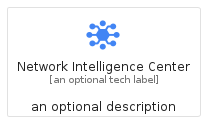
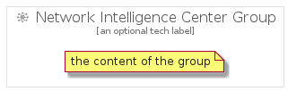

# NetworkIntelligenceCenter


```text
gcp/Item/NetworkIntelligenceCenter
```

```text
include('gcp/Item/NetworkIntelligenceCenter')
```


| Illustration | NetworkIntelligenceCenter | NetworkIntelligenceCenterCard | NetworkIntelligenceCenterGroup |
| :---: | :---: | :---: | :---: |
|  |  |  |  |


## Sprites
The item provides the following sriptes:

- `<$NetworkIntelligenceCenterXs>`
- `<$NetworkIntelligenceCenterSm>`
- `<$NetworkIntelligenceCenterMd>`
- `<$NetworkIntelligenceCenterLg>`


## NetworkIntelligenceCenter

### Load remotely
```plantuml
@startuml
' configures the library
!global $LIB_BASE_LOCATION="https://raw.githubusercontent.com/tmorin/plantuml-libs/master/distribution"

' loads the library's bootstrap
!include $LIB_BASE_LOCATION/bootstrap.puml

' loads the package bootstrap
include('gcp/bootstrap')

' loads the Item which embeds the element NetworkIntelligenceCenter
include('gcp/Item/NetworkIntelligenceCenter')

' renders the element
NetworkIntelligenceCenter('NetworkIntelligenceCenter', 'Network Intelligence Center', 'an optional tech label', 'an optional description')
@enduml
```

### Load locally
```plantuml
@startuml
' configures the library
!global $INCLUSION_MODE="local"
!global $LIB_BASE_LOCATION="../.."

' loads the library's bootstrap
!include $LIB_BASE_LOCATION/bootstrap.puml

' loads the package bootstrap
include('gcp/bootstrap')

' loads the Item which embeds the element NetworkIntelligenceCenter
include('gcp/Item/NetworkIntelligenceCenter')

' renders the element
NetworkIntelligenceCenter('NetworkIntelligenceCenter', 'Network Intelligence Center', 'an optional tech label', 'an optional description')
@enduml
```

## NetworkIntelligenceCenterCard

### Load remotely
```plantuml
@startuml
' configures the library
!global $LIB_BASE_LOCATION="https://raw.githubusercontent.com/tmorin/plantuml-libs/master/distribution"

' loads the library's bootstrap
!include $LIB_BASE_LOCATION/bootstrap.puml

' loads the package bootstrap
include('gcp/bootstrap')

' loads the Item which embeds the element NetworkIntelligenceCenterCard
include('gcp/Item/NetworkIntelligenceCenter')

' renders the element
NetworkIntelligenceCenterCard('NetworkIntelligenceCenterCard', 'Network Intelligence Center Card', 'an optional description')
@enduml
```

### Load locally
```plantuml
@startuml
' configures the library
!global $INCLUSION_MODE="local"
!global $LIB_BASE_LOCATION="../.."

' loads the library's bootstrap
!include $LIB_BASE_LOCATION/bootstrap.puml

' loads the package bootstrap
include('gcp/bootstrap')

' loads the Item which embeds the element NetworkIntelligenceCenterCard
include('gcp/Item/NetworkIntelligenceCenter')

' renders the element
NetworkIntelligenceCenterCard('NetworkIntelligenceCenterCard', 'Network Intelligence Center Card', 'an optional description')
@enduml
```

## NetworkIntelligenceCenterGroup

### Load remotely
```plantuml
@startuml
' configures the library
!global $LIB_BASE_LOCATION="https://raw.githubusercontent.com/tmorin/plantuml-libs/master/distribution"

' loads the library's bootstrap
!include $LIB_BASE_LOCATION/bootstrap.puml

' loads the package bootstrap
include('gcp/bootstrap')

' loads the Item which embeds the element NetworkIntelligenceCenterGroup
include('gcp/Item/NetworkIntelligenceCenter')

' renders the element
NetworkIntelligenceCenterGroup('NetworkIntelligenceCenterGroup', 'Network Intelligence Center Group', 'an optional tech label') {
    note as note
        the content of the group
    end note
}
@enduml
```

### Load locally
```plantuml
@startuml
' configures the library
!global $INCLUSION_MODE="local"
!global $LIB_BASE_LOCATION="../.."

' loads the library's bootstrap
!include $LIB_BASE_LOCATION/bootstrap.puml

' loads the package bootstrap
include('gcp/bootstrap')

' loads the Item which embeds the element NetworkIntelligenceCenterGroup
include('gcp/Item/NetworkIntelligenceCenter')

' renders the element
NetworkIntelligenceCenterGroup('NetworkIntelligenceCenterGroup', 'Network Intelligence Center Group', 'an optional tech label') {
    note as note
        the content of the group
    end note
}
@enduml
```

