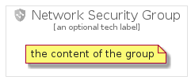

# NetworkSecurity


```text
gcp/Item/NetworkSecurity
```

```text
include('gcp/Item/NetworkSecurity')
```


| Illustration | NetworkSecurity | NetworkSecurityCard | NetworkSecurityGroup |
| :---: | :---: | :---: | :---: |
|  |  |  |  |


## NetworkSecurity

### Load remotely
```plantuml
@startuml
' configures the library
!global $LIB_BASE_LOCATION="https://raw.githubusercontent.com/tmorin/plantuml-libs/master/distribution"

' loads the library's bootstrap
!include $LIB_BASE_LOCATION/bootstrap.puml

' loads the package bootstrap
include('gcp/bootstrap')

' loads the Item which embeds the element NetworkSecurity
include('gcp/Item/NetworkSecurity')

' renders the element
NetworkSecurity('NetworkSecurity', 'Network Security', 'an optional tech label')
@enduml
```

### Load locally
```plantuml
@startuml
' configures the library
!global $INCLUSION_MODE="local"
!global $LIB_BASE_LOCATION="../.."

' loads the library's bootstrap
!include $LIB_BASE_LOCATION/bootstrap.puml

' loads the package bootstrap
include('gcp/bootstrap')

' loads the Item which embeds the element NetworkSecurity
include('gcp/Item/NetworkSecurity')

' renders the element
NetworkSecurity('NetworkSecurity', 'Network Security', 'an optional tech label')
@enduml
```

## NetworkSecurityCard

### Load remotely
```plantuml
@startuml
' configures the library
!global $LIB_BASE_LOCATION="https://raw.githubusercontent.com/tmorin/plantuml-libs/master/distribution"

' loads the library's bootstrap
!include $LIB_BASE_LOCATION/bootstrap.puml

' loads the package bootstrap
include('gcp/bootstrap')

' loads the Item which embeds the element NetworkSecurityCard
include('gcp/Item/NetworkSecurity')

' renders the element
NetworkSecurityCard('NetworkSecurityCard', 'Network Security Card', 'an optional description')
@enduml
```

### Load locally
```plantuml
@startuml
' configures the library
!global $INCLUSION_MODE="local"
!global $LIB_BASE_LOCATION="../.."

' loads the library's bootstrap
!include $LIB_BASE_LOCATION/bootstrap.puml

' loads the package bootstrap
include('gcp/bootstrap')

' loads the Item which embeds the element NetworkSecurityCard
include('gcp/Item/NetworkSecurity')

' renders the element
NetworkSecurityCard('NetworkSecurityCard', 'Network Security Card', 'an optional description')
@enduml
```

## NetworkSecurityGroup

### Load remotely
```plantuml
@startuml
' configures the library
!global $LIB_BASE_LOCATION="https://raw.githubusercontent.com/tmorin/plantuml-libs/master/distribution"

' loads the library's bootstrap
!include $LIB_BASE_LOCATION/bootstrap.puml

' loads the package bootstrap
include('gcp/bootstrap')

' loads the Item which embeds the element NetworkSecurityGroup
include('gcp/Item/NetworkSecurity')

' renders the element
NetworkSecurityGroup('NetworkSecurityGroup', 'Network Security Group', 'an optional tech label') {
    note as note
        the content of the group
    end note
}
@enduml
```

### Load locally
```plantuml
@startuml
' configures the library
!global $INCLUSION_MODE="local"
!global $LIB_BASE_LOCATION="../.."

' loads the library's bootstrap
!include $LIB_BASE_LOCATION/bootstrap.puml

' loads the package bootstrap
include('gcp/bootstrap')

' loads the Item which embeds the element NetworkSecurityGroup
include('gcp/Item/NetworkSecurity')

' renders the element
NetworkSecurityGroup('NetworkSecurityGroup', 'Network Security Group', 'an optional tech label') {
    note as note
        the content of the group
    end note
}
@enduml
```

