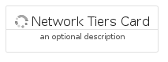
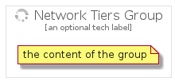

# NetworkTiers


```text
gcp/Item/NetworkTiers
```

```text
include('gcp/Item/NetworkTiers')
```


| Illustration | NetworkTiers | NetworkTiersCard | NetworkTiersGroup |
| :---: | :---: | :---: | :---: |
|  |  |  |  |


## NetworkTiers

### Load remotely
```plantuml
@startuml
' configures the library
!global $LIB_BASE_LOCATION="https://raw.githubusercontent.com/tmorin/plantuml-libs/master/distribution"

' loads the library's bootstrap
!include $LIB_BASE_LOCATION/bootstrap.puml

' loads the package bootstrap
include('gcp/bootstrap')

' loads the Item which embeds the element NetworkTiers
include('gcp/Item/NetworkTiers')

' renders the element
NetworkTiers('NetworkTiers', 'Network Tiers', 'an optional tech label')
@enduml
```

### Load locally
```plantuml
@startuml
' configures the library
!global $INCLUSION_MODE="local"
!global $LIB_BASE_LOCATION="../.."

' loads the library's bootstrap
!include $LIB_BASE_LOCATION/bootstrap.puml

' loads the package bootstrap
include('gcp/bootstrap')

' loads the Item which embeds the element NetworkTiers
include('gcp/Item/NetworkTiers')

' renders the element
NetworkTiers('NetworkTiers', 'Network Tiers', 'an optional tech label')
@enduml
```

## NetworkTiersCard

### Load remotely
```plantuml
@startuml
' configures the library
!global $LIB_BASE_LOCATION="https://raw.githubusercontent.com/tmorin/plantuml-libs/master/distribution"

' loads the library's bootstrap
!include $LIB_BASE_LOCATION/bootstrap.puml

' loads the package bootstrap
include('gcp/bootstrap')

' loads the Item which embeds the element NetworkTiersCard
include('gcp/Item/NetworkTiers')

' renders the element
NetworkTiersCard('NetworkTiersCard', 'Network Tiers Card', 'an optional description')
@enduml
```

### Load locally
```plantuml
@startuml
' configures the library
!global $INCLUSION_MODE="local"
!global $LIB_BASE_LOCATION="../.."

' loads the library's bootstrap
!include $LIB_BASE_LOCATION/bootstrap.puml

' loads the package bootstrap
include('gcp/bootstrap')

' loads the Item which embeds the element NetworkTiersCard
include('gcp/Item/NetworkTiers')

' renders the element
NetworkTiersCard('NetworkTiersCard', 'Network Tiers Card', 'an optional description')
@enduml
```

## NetworkTiersGroup

### Load remotely
```plantuml
@startuml
' configures the library
!global $LIB_BASE_LOCATION="https://raw.githubusercontent.com/tmorin/plantuml-libs/master/distribution"

' loads the library's bootstrap
!include $LIB_BASE_LOCATION/bootstrap.puml

' loads the package bootstrap
include('gcp/bootstrap')

' loads the Item which embeds the element NetworkTiersGroup
include('gcp/Item/NetworkTiers')

' renders the element
NetworkTiersGroup('NetworkTiersGroup', 'Network Tiers Group', 'an optional tech label') {
    note as note
        the content of the group
    end note
}
@enduml
```

### Load locally
```plantuml
@startuml
' configures the library
!global $INCLUSION_MODE="local"
!global $LIB_BASE_LOCATION="../.."

' loads the library's bootstrap
!include $LIB_BASE_LOCATION/bootstrap.puml

' loads the package bootstrap
include('gcp/bootstrap')

' loads the Item which embeds the element NetworkTiersGroup
include('gcp/Item/NetworkTiers')

' renders the element
NetworkTiersGroup('NetworkTiersGroup', 'Network Tiers Group', 'an optional tech label') {
    note as note
        the content of the group
    end note
}
@enduml
```

