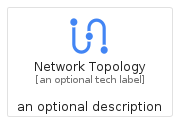
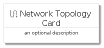
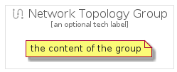

# NetworkTopology


```text
gcp/Item/NetworkTopology
```

```text
include('gcp/Item/NetworkTopology')
```


| Illustration | NetworkTopology | NetworkTopologyCard | NetworkTopologyGroup |
| :---: | :---: | :---: | :---: |
|  |  |  |  |


## NetworkTopology

### Load remotely
```plantuml
@startuml
' configures the library
!global $LIB_BASE_LOCATION="https://raw.githubusercontent.com/tmorin/plantuml-libs/master/distribution"

' loads the library's bootstrap
!include $LIB_BASE_LOCATION/bootstrap.puml

' loads the package bootstrap
include('gcp/bootstrap')

' loads the Item which embeds the element NetworkTopology
include('gcp/Item/NetworkTopology')

' renders the element
NetworkTopology('NetworkTopology', 'Network Topology', 'an optional tech label', 'an optional description')
@enduml
```

### Load locally
```plantuml
@startuml
' configures the library
!global $INCLUSION_MODE="local"
!global $LIB_BASE_LOCATION="../.."

' loads the library's bootstrap
!include $LIB_BASE_LOCATION/bootstrap.puml

' loads the package bootstrap
include('gcp/bootstrap')

' loads the Item which embeds the element NetworkTopology
include('gcp/Item/NetworkTopology')

' renders the element
NetworkTopology('NetworkTopology', 'Network Topology', 'an optional tech label', 'an optional description')
@enduml
```

## NetworkTopologyCard

### Load remotely
```plantuml
@startuml
' configures the library
!global $LIB_BASE_LOCATION="https://raw.githubusercontent.com/tmorin/plantuml-libs/master/distribution"

' loads the library's bootstrap
!include $LIB_BASE_LOCATION/bootstrap.puml

' loads the package bootstrap
include('gcp/bootstrap')

' loads the Item which embeds the element NetworkTopologyCard
include('gcp/Item/NetworkTopology')

' renders the element
NetworkTopologyCard('NetworkTopologyCard', 'Network Topology Card', 'an optional description')
@enduml
```

### Load locally
```plantuml
@startuml
' configures the library
!global $INCLUSION_MODE="local"
!global $LIB_BASE_LOCATION="../.."

' loads the library's bootstrap
!include $LIB_BASE_LOCATION/bootstrap.puml

' loads the package bootstrap
include('gcp/bootstrap')

' loads the Item which embeds the element NetworkTopologyCard
include('gcp/Item/NetworkTopology')

' renders the element
NetworkTopologyCard('NetworkTopologyCard', 'Network Topology Card', 'an optional description')
@enduml
```

## NetworkTopologyGroup

### Load remotely
```plantuml
@startuml
' configures the library
!global $LIB_BASE_LOCATION="https://raw.githubusercontent.com/tmorin/plantuml-libs/master/distribution"

' loads the library's bootstrap
!include $LIB_BASE_LOCATION/bootstrap.puml

' loads the package bootstrap
include('gcp/bootstrap')

' loads the Item which embeds the element NetworkTopologyGroup
include('gcp/Item/NetworkTopology')

' renders the element
NetworkTopologyGroup('NetworkTopologyGroup', 'Network Topology Group', 'an optional tech label') {
    note as note
        the content of the group
    end note
}
@enduml
```

### Load locally
```plantuml
@startuml
' configures the library
!global $INCLUSION_MODE="local"
!global $LIB_BASE_LOCATION="../.."

' loads the library's bootstrap
!include $LIB_BASE_LOCATION/bootstrap.puml

' loads the package bootstrap
include('gcp/bootstrap')

' loads the Item which embeds the element NetworkTopologyGroup
include('gcp/Item/NetworkTopology')

' renders the element
NetworkTopologyGroup('NetworkTopologyGroup', 'Network Topology Group', 'an optional tech label') {
    note as note
        the content of the group
    end note
}
@enduml
```

