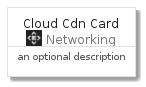

# CloudCdn


```text
gcp/Item/Networking/CloudCdn
```

```text
include('gcp/Item/Networking/CloudCdn')
```


| Illustration | CloudCdn | CloudCdnCard | CloudCdnGroup |
| :---: | :---: | :---: | :---: |
|  |  |  |  |


## CloudCdn

### Load remotely
```plantuml
@startuml
' configures the library
!global $LIB_BASE_LOCATION="https://github.com/tmorin/plantuml-libs/distribution"

' loads the library's bootstrap
!include $LIB_BASE_LOCATION/bootstrap.puml

' loads the package bootstrap
include('gcp/bootstrap')

' loads the Item which embeds the element CloudCdn
include('gcp/Item/Networking/CloudCdn')

' renders the element
CloudCdn('CloudCdn', 'Cloud Cdn', 'an optional tech label')
@enduml
```

### Load locally
```plantuml
@startuml
' configures the library
!global $INCLUSION_MODE="local"
!global $LIB_BASE_LOCATION="../../.."

' loads the library's bootstrap
!include $LIB_BASE_LOCATION/bootstrap.puml

' loads the package bootstrap
include('gcp/bootstrap')

' loads the Item which embeds the element CloudCdn
include('gcp/Item/Networking/CloudCdn')

' renders the element
CloudCdn('CloudCdn', 'Cloud Cdn', 'an optional tech label')
@enduml
```

## CloudCdnCard

### Load remotely
```plantuml
@startuml
' configures the library
!global $LIB_BASE_LOCATION="https://github.com/tmorin/plantuml-libs/distribution"

' loads the library's bootstrap
!include $LIB_BASE_LOCATION/bootstrap.puml

' loads the package bootstrap
include('gcp/bootstrap')

' loads the Item which embeds the element CloudCdnCard
include('gcp/Item/Networking/CloudCdn')

' renders the element
CloudCdnCard('CloudCdnCard', 'Cloud Cdn Card', 'an optional description')
@enduml
```

### Load locally
```plantuml
@startuml
' configures the library
!global $INCLUSION_MODE="local"
!global $LIB_BASE_LOCATION="../../.."

' loads the library's bootstrap
!include $LIB_BASE_LOCATION/bootstrap.puml

' loads the package bootstrap
include('gcp/bootstrap')

' loads the Item which embeds the element CloudCdnCard
include('gcp/Item/Networking/CloudCdn')

' renders the element
CloudCdnCard('CloudCdnCard', 'Cloud Cdn Card', 'an optional description')
@enduml
```

## CloudCdnGroup

### Load remotely
```plantuml
@startuml
' configures the library
!global $LIB_BASE_LOCATION="https://github.com/tmorin/plantuml-libs/distribution"

' loads the library's bootstrap
!include $LIB_BASE_LOCATION/bootstrap.puml

' loads the package bootstrap
include('gcp/bootstrap')

' loads the Item which embeds the element CloudCdnGroup
include('gcp/Item/Networking/CloudCdn')

' renders the element
CloudCdnGroup('CloudCdnGroup', 'Cloud Cdn Group', 'an optional tech label') {
    note as note
        the content of the group
    end note
}
@enduml
```

### Load locally
```plantuml
@startuml
' configures the library
!global $INCLUSION_MODE="local"
!global $LIB_BASE_LOCATION="../../.."

' loads the library's bootstrap
!include $LIB_BASE_LOCATION/bootstrap.puml

' loads the package bootstrap
include('gcp/bootstrap')

' loads the Item which embeds the element CloudCdnGroup
include('gcp/Item/Networking/CloudCdn')

' renders the element
CloudCdnGroup('CloudCdnGroup', 'Cloud Cdn Group', 'an optional tech label') {
    note as note
        the content of the group
    end note
}
@enduml
```

