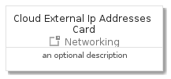

# CloudExternalIpAddresses


```text
gcp/Item/Networking/CloudExternalIpAddresses
```

```text
include('gcp/Item/Networking/CloudExternalIpAddresses')
```


| Illustration | CloudExternalIpAddresses | CloudExternalIpAddressesCard | CloudExternalIpAddressesGroup |
| :---: | :---: | :---: | :---: |
|  |  |  |  |


## CloudExternalIpAddresses

### Load remotely
```plantuml
@startuml
' configures the library
!global $LIB_BASE_LOCATION="https://github.com/tmorin/plantuml-libs/distribution"

' loads the library's bootstrap
!include $LIB_BASE_LOCATION/bootstrap.puml

' loads the package bootstrap
include('gcp/bootstrap')

' loads the Item which embeds the element CloudExternalIpAddresses
include('gcp/Item/Networking/CloudExternalIpAddresses')

' renders the element
CloudExternalIpAddresses('CloudExternalIpAddresses', 'Cloud External Ip Addresses', 'an optional tech label')
@enduml
```

### Load locally
```plantuml
@startuml
' configures the library
!global $INCLUSION_MODE="local"
!global $LIB_BASE_LOCATION="../../.."

' loads the library's bootstrap
!include $LIB_BASE_LOCATION/bootstrap.puml

' loads the package bootstrap
include('gcp/bootstrap')

' loads the Item which embeds the element CloudExternalIpAddresses
include('gcp/Item/Networking/CloudExternalIpAddresses')

' renders the element
CloudExternalIpAddresses('CloudExternalIpAddresses', 'Cloud External Ip Addresses', 'an optional tech label')
@enduml
```

## CloudExternalIpAddressesCard

### Load remotely
```plantuml
@startuml
' configures the library
!global $LIB_BASE_LOCATION="https://github.com/tmorin/plantuml-libs/distribution"

' loads the library's bootstrap
!include $LIB_BASE_LOCATION/bootstrap.puml

' loads the package bootstrap
include('gcp/bootstrap')

' loads the Item which embeds the element CloudExternalIpAddressesCard
include('gcp/Item/Networking/CloudExternalIpAddresses')

' renders the element
CloudExternalIpAddressesCard('CloudExternalIpAddressesCard', 'Cloud External Ip Addresses Card', 'an optional description')
@enduml
```

### Load locally
```plantuml
@startuml
' configures the library
!global $INCLUSION_MODE="local"
!global $LIB_BASE_LOCATION="../../.."

' loads the library's bootstrap
!include $LIB_BASE_LOCATION/bootstrap.puml

' loads the package bootstrap
include('gcp/bootstrap')

' loads the Item which embeds the element CloudExternalIpAddressesCard
include('gcp/Item/Networking/CloudExternalIpAddresses')

' renders the element
CloudExternalIpAddressesCard('CloudExternalIpAddressesCard', 'Cloud External Ip Addresses Card', 'an optional description')
@enduml
```

## CloudExternalIpAddressesGroup

### Load remotely
```plantuml
@startuml
' configures the library
!global $LIB_BASE_LOCATION="https://github.com/tmorin/plantuml-libs/distribution"

' loads the library's bootstrap
!include $LIB_BASE_LOCATION/bootstrap.puml

' loads the package bootstrap
include('gcp/bootstrap')

' loads the Item which embeds the element CloudExternalIpAddressesGroup
include('gcp/Item/Networking/CloudExternalIpAddresses')

' renders the element
CloudExternalIpAddressesGroup('CloudExternalIpAddressesGroup', 'Cloud External Ip Addresses Group', 'an optional tech label') {
    note as note
        the content of the group
    end note
}
@enduml
```

### Load locally
```plantuml
@startuml
' configures the library
!global $INCLUSION_MODE="local"
!global $LIB_BASE_LOCATION="../../.."

' loads the library's bootstrap
!include $LIB_BASE_LOCATION/bootstrap.puml

' loads the package bootstrap
include('gcp/bootstrap')

' loads the Item which embeds the element CloudExternalIpAddressesGroup
include('gcp/Item/Networking/CloudExternalIpAddresses')

' renders the element
CloudExternalIpAddressesGroup('CloudExternalIpAddressesGroup', 'Cloud External Ip Addresses Group', 'an optional tech label') {
    note as note
        the content of the group
    end note
}
@enduml
```

