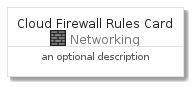
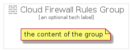

# CloudFirewallRules


```text
gcp/Item/Networking/CloudFirewallRules
```

```text
include('gcp/Item/Networking/CloudFirewallRules')
```


| Illustration | CloudFirewallRules | CloudFirewallRulesCard | CloudFirewallRulesGroup |
| :---: | :---: | :---: | :---: |
|  |  |  |  |


## CloudFirewallRules

### Load remotely
```plantuml
@startuml
' configures the library
!global $LIB_BASE_LOCATION="https://raw.githubusercontent.com/tmorin/plantuml-libs/master/distribution"

' loads the library's bootstrap
!include $LIB_BASE_LOCATION/bootstrap.puml

' loads the package bootstrap
include('gcp/bootstrap')

' loads the Item which embeds the element CloudFirewallRules
include('gcp/Item/Networking/CloudFirewallRules')

' renders the element
CloudFirewallRules('CloudFirewallRules', 'Cloud Firewall Rules', 'an optional tech label')
@enduml
```

### Load locally
```plantuml
@startuml
' configures the library
!global $INCLUSION_MODE="local"
!global $LIB_BASE_LOCATION="../../.."

' loads the library's bootstrap
!include $LIB_BASE_LOCATION/bootstrap.puml

' loads the package bootstrap
include('gcp/bootstrap')

' loads the Item which embeds the element CloudFirewallRules
include('gcp/Item/Networking/CloudFirewallRules')

' renders the element
CloudFirewallRules('CloudFirewallRules', 'Cloud Firewall Rules', 'an optional tech label')
@enduml
```

## CloudFirewallRulesCard

### Load remotely
```plantuml
@startuml
' configures the library
!global $LIB_BASE_LOCATION="https://raw.githubusercontent.com/tmorin/plantuml-libs/master/distribution"

' loads the library's bootstrap
!include $LIB_BASE_LOCATION/bootstrap.puml

' loads the package bootstrap
include('gcp/bootstrap')

' loads the Item which embeds the element CloudFirewallRulesCard
include('gcp/Item/Networking/CloudFirewallRules')

' renders the element
CloudFirewallRulesCard('CloudFirewallRulesCard', 'Cloud Firewall Rules Card', 'an optional description')
@enduml
```

### Load locally
```plantuml
@startuml
' configures the library
!global $INCLUSION_MODE="local"
!global $LIB_BASE_LOCATION="../../.."

' loads the library's bootstrap
!include $LIB_BASE_LOCATION/bootstrap.puml

' loads the package bootstrap
include('gcp/bootstrap')

' loads the Item which embeds the element CloudFirewallRulesCard
include('gcp/Item/Networking/CloudFirewallRules')

' renders the element
CloudFirewallRulesCard('CloudFirewallRulesCard', 'Cloud Firewall Rules Card', 'an optional description')
@enduml
```

## CloudFirewallRulesGroup

### Load remotely
```plantuml
@startuml
' configures the library
!global $LIB_BASE_LOCATION="https://raw.githubusercontent.com/tmorin/plantuml-libs/master/distribution"

' loads the library's bootstrap
!include $LIB_BASE_LOCATION/bootstrap.puml

' loads the package bootstrap
include('gcp/bootstrap')

' loads the Item which embeds the element CloudFirewallRulesGroup
include('gcp/Item/Networking/CloudFirewallRules')

' renders the element
CloudFirewallRulesGroup('CloudFirewallRulesGroup', 'Cloud Firewall Rules Group', 'an optional tech label') {
    note as note
        the content of the group
    end note
}
@enduml
```

### Load locally
```plantuml
@startuml
' configures the library
!global $INCLUSION_MODE="local"
!global $LIB_BASE_LOCATION="../../.."

' loads the library's bootstrap
!include $LIB_BASE_LOCATION/bootstrap.puml

' loads the package bootstrap
include('gcp/bootstrap')

' loads the Item which embeds the element CloudFirewallRulesGroup
include('gcp/Item/Networking/CloudFirewallRules')

' renders the element
CloudFirewallRulesGroup('CloudFirewallRulesGroup', 'Cloud Firewall Rules Group', 'an optional tech label') {
    note as note
        the content of the group
    end note
}
@enduml
```

