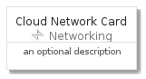
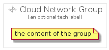

# CloudNetwork


```text
gcp/Item/Networking/CloudNetwork
```

```text
include('gcp/Item/Networking/CloudNetwork')
```


| Illustration | CloudNetwork | CloudNetworkCard | CloudNetworkGroup |
| :---: | :---: | :---: | :---: |
|  |  |  |  |


## CloudNetwork

### Load remotely
```plantuml
@startuml
' configures the library
!global $LIB_BASE_LOCATION="https://raw.githubusercontent.com/tmorin/plantuml-libs/master/distribution"

' loads the library's bootstrap
!include $LIB_BASE_LOCATION/bootstrap.puml

' loads the package bootstrap
include('gcp/bootstrap')

' loads the Item which embeds the element CloudNetwork
include('gcp/Item/Networking/CloudNetwork')

' renders the element
CloudNetwork('CloudNetwork', 'Cloud Network', 'an optional tech label')
@enduml
```

### Load locally
```plantuml
@startuml
' configures the library
!global $INCLUSION_MODE="local"
!global $LIB_BASE_LOCATION="../../.."

' loads the library's bootstrap
!include $LIB_BASE_LOCATION/bootstrap.puml

' loads the package bootstrap
include('gcp/bootstrap')

' loads the Item which embeds the element CloudNetwork
include('gcp/Item/Networking/CloudNetwork')

' renders the element
CloudNetwork('CloudNetwork', 'Cloud Network', 'an optional tech label')
@enduml
```

## CloudNetworkCard

### Load remotely
```plantuml
@startuml
' configures the library
!global $LIB_BASE_LOCATION="https://raw.githubusercontent.com/tmorin/plantuml-libs/master/distribution"

' loads the library's bootstrap
!include $LIB_BASE_LOCATION/bootstrap.puml

' loads the package bootstrap
include('gcp/bootstrap')

' loads the Item which embeds the element CloudNetworkCard
include('gcp/Item/Networking/CloudNetwork')

' renders the element
CloudNetworkCard('CloudNetworkCard', 'Cloud Network Card', 'an optional description')
@enduml
```

### Load locally
```plantuml
@startuml
' configures the library
!global $INCLUSION_MODE="local"
!global $LIB_BASE_LOCATION="../../.."

' loads the library's bootstrap
!include $LIB_BASE_LOCATION/bootstrap.puml

' loads the package bootstrap
include('gcp/bootstrap')

' loads the Item which embeds the element CloudNetworkCard
include('gcp/Item/Networking/CloudNetwork')

' renders the element
CloudNetworkCard('CloudNetworkCard', 'Cloud Network Card', 'an optional description')
@enduml
```

## CloudNetworkGroup

### Load remotely
```plantuml
@startuml
' configures the library
!global $LIB_BASE_LOCATION="https://raw.githubusercontent.com/tmorin/plantuml-libs/master/distribution"

' loads the library's bootstrap
!include $LIB_BASE_LOCATION/bootstrap.puml

' loads the package bootstrap
include('gcp/bootstrap')

' loads the Item which embeds the element CloudNetworkGroup
include('gcp/Item/Networking/CloudNetwork')

' renders the element
CloudNetworkGroup('CloudNetworkGroup', 'Cloud Network Group', 'an optional tech label') {
    note as note
        the content of the group
    end note
}
@enduml
```

### Load locally
```plantuml
@startuml
' configures the library
!global $INCLUSION_MODE="local"
!global $LIB_BASE_LOCATION="../../.."

' loads the library's bootstrap
!include $LIB_BASE_LOCATION/bootstrap.puml

' loads the package bootstrap
include('gcp/bootstrap')

' loads the Item which embeds the element CloudNetworkGroup
include('gcp/Item/Networking/CloudNetwork')

' renders the element
CloudNetworkGroup('CloudNetworkGroup', 'Cloud Network Group', 'an optional tech label') {
    note as note
        the content of the group
    end note
}
@enduml
```

