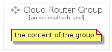

# CloudRouter


```text
gcp/Item/Networking/CloudRouter
```

```text
include('gcp/Item/Networking/CloudRouter')
```


| Illustration | CloudRouter | CloudRouterCard | CloudRouterGroup |
| :---: | :---: | :---: | :---: |
|  |  |  |  |


## CloudRouter

### Load remotely
```plantuml
@startuml
' configures the library
!global $LIB_BASE_LOCATION="https://github.com/tmorin/plantuml-libs/distribution"

' loads the library's bootstrap
!include $LIB_BASE_LOCATION/bootstrap.puml

' loads the package bootstrap
include('gcp/bootstrap')

' loads the Item which embeds the element CloudRouter
include('gcp/Item/Networking/CloudRouter')

' renders the element
CloudRouter('CloudRouter', 'Cloud Router', 'an optional tech label')
@enduml
```

### Load locally
```plantuml
@startuml
' configures the library
!global $INCLUSION_MODE="local"
!global $LIB_BASE_LOCATION="../../.."

' loads the library's bootstrap
!include $LIB_BASE_LOCATION/bootstrap.puml

' loads the package bootstrap
include('gcp/bootstrap')

' loads the Item which embeds the element CloudRouter
include('gcp/Item/Networking/CloudRouter')

' renders the element
CloudRouter('CloudRouter', 'Cloud Router', 'an optional tech label')
@enduml
```

## CloudRouterCard

### Load remotely
```plantuml
@startuml
' configures the library
!global $LIB_BASE_LOCATION="https://github.com/tmorin/plantuml-libs/distribution"

' loads the library's bootstrap
!include $LIB_BASE_LOCATION/bootstrap.puml

' loads the package bootstrap
include('gcp/bootstrap')

' loads the Item which embeds the element CloudRouterCard
include('gcp/Item/Networking/CloudRouter')

' renders the element
CloudRouterCard('CloudRouterCard', 'Cloud Router Card', 'an optional description')
@enduml
```

### Load locally
```plantuml
@startuml
' configures the library
!global $INCLUSION_MODE="local"
!global $LIB_BASE_LOCATION="../../.."

' loads the library's bootstrap
!include $LIB_BASE_LOCATION/bootstrap.puml

' loads the package bootstrap
include('gcp/bootstrap')

' loads the Item which embeds the element CloudRouterCard
include('gcp/Item/Networking/CloudRouter')

' renders the element
CloudRouterCard('CloudRouterCard', 'Cloud Router Card', 'an optional description')
@enduml
```

## CloudRouterGroup

### Load remotely
```plantuml
@startuml
' configures the library
!global $LIB_BASE_LOCATION="https://github.com/tmorin/plantuml-libs/distribution"

' loads the library's bootstrap
!include $LIB_BASE_LOCATION/bootstrap.puml

' loads the package bootstrap
include('gcp/bootstrap')

' loads the Item which embeds the element CloudRouterGroup
include('gcp/Item/Networking/CloudRouter')

' renders the element
CloudRouterGroup('CloudRouterGroup', 'Cloud Router Group', 'an optional tech label') {
    note as note
        the content of the group
    end note
}
@enduml
```

### Load locally
```plantuml
@startuml
' configures the library
!global $INCLUSION_MODE="local"
!global $LIB_BASE_LOCATION="../../.."

' loads the library's bootstrap
!include $LIB_BASE_LOCATION/bootstrap.puml

' loads the package bootstrap
include('gcp/bootstrap')

' loads the Item which embeds the element CloudRouterGroup
include('gcp/Item/Networking/CloudRouter')

' renders the element
CloudRouterGroup('CloudRouterGroup', 'Cloud Router Group', 'an optional tech label') {
    note as note
        the content of the group
    end note
}
@enduml
```

