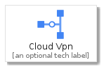

# CloudVpn


```text
gcp/Item/Networking/CloudVpn
```

```text
include('gcp/Item/Networking/CloudVpn')
```


| Illustration | CloudVpn | CloudVpnCard | CloudVpnGroup |
| :---: | :---: | :---: | :---: |
|  |  |  |  |


## CloudVpn

### Load remotely
```plantuml
@startuml
' configures the library
!global $LIB_BASE_LOCATION="https://raw.githubusercontent.com/tmorin/plantuml-libs/master/distribution"

' loads the library's bootstrap
!include $LIB_BASE_LOCATION/bootstrap.puml

' loads the package bootstrap
include('gcp/bootstrap')

' loads the Item which embeds the element CloudVpn
include('gcp/Item/Networking/CloudVpn')

' renders the element
CloudVpn('CloudVpn', 'Cloud Vpn', 'an optional tech label')
@enduml
```

### Load locally
```plantuml
@startuml
' configures the library
!global $INCLUSION_MODE="local"
!global $LIB_BASE_LOCATION="../../.."

' loads the library's bootstrap
!include $LIB_BASE_LOCATION/bootstrap.puml

' loads the package bootstrap
include('gcp/bootstrap')

' loads the Item which embeds the element CloudVpn
include('gcp/Item/Networking/CloudVpn')

' renders the element
CloudVpn('CloudVpn', 'Cloud Vpn', 'an optional tech label')
@enduml
```

## CloudVpnCard

### Load remotely
```plantuml
@startuml
' configures the library
!global $LIB_BASE_LOCATION="https://raw.githubusercontent.com/tmorin/plantuml-libs/master/distribution"

' loads the library's bootstrap
!include $LIB_BASE_LOCATION/bootstrap.puml

' loads the package bootstrap
include('gcp/bootstrap')

' loads the Item which embeds the element CloudVpnCard
include('gcp/Item/Networking/CloudVpn')

' renders the element
CloudVpnCard('CloudVpnCard', 'Cloud Vpn Card', 'an optional description')
@enduml
```

### Load locally
```plantuml
@startuml
' configures the library
!global $INCLUSION_MODE="local"
!global $LIB_BASE_LOCATION="../../.."

' loads the library's bootstrap
!include $LIB_BASE_LOCATION/bootstrap.puml

' loads the package bootstrap
include('gcp/bootstrap')

' loads the Item which embeds the element CloudVpnCard
include('gcp/Item/Networking/CloudVpn')

' renders the element
CloudVpnCard('CloudVpnCard', 'Cloud Vpn Card', 'an optional description')
@enduml
```

## CloudVpnGroup

### Load remotely
```plantuml
@startuml
' configures the library
!global $LIB_BASE_LOCATION="https://raw.githubusercontent.com/tmorin/plantuml-libs/master/distribution"

' loads the library's bootstrap
!include $LIB_BASE_LOCATION/bootstrap.puml

' loads the package bootstrap
include('gcp/bootstrap')

' loads the Item which embeds the element CloudVpnGroup
include('gcp/Item/Networking/CloudVpn')

' renders the element
CloudVpnGroup('CloudVpnGroup', 'Cloud Vpn Group', 'an optional tech label') {
    note as note
        the content of the group
    end note
}
@enduml
```

### Load locally
```plantuml
@startuml
' configures the library
!global $INCLUSION_MODE="local"
!global $LIB_BASE_LOCATION="../../.."

' loads the library's bootstrap
!include $LIB_BASE_LOCATION/bootstrap.puml

' loads the package bootstrap
include('gcp/bootstrap')

' loads the Item which embeds the element CloudVpnGroup
include('gcp/Item/Networking/CloudVpn')

' renders the element
CloudVpnGroup('CloudVpnGroup', 'Cloud Vpn Group', 'an optional tech label') {
    note as note
        the content of the group
    end note
}
@enduml
```

