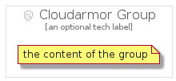

# Cloudarmor


```text
gcp/Item/Networking/Cloudarmor
```

```text
include('gcp/Item/Networking/Cloudarmor')
```


| Illustration | Cloudarmor | CloudarmorCard | CloudarmorGroup |
| :---: | :---: | :---: | :---: |
|  |  |  |  |


## Cloudarmor

### Load remotely
```plantuml
@startuml
' configures the library
!global $LIB_BASE_LOCATION="https://github.com/tmorin/plantuml-libs/distribution"

' loads the library's bootstrap
!include $LIB_BASE_LOCATION/bootstrap.puml

' loads the package bootstrap
include('gcp/bootstrap')

' loads the Item which embeds the element Cloudarmor
include('gcp/Item/Networking/Cloudarmor')

' renders the element
Cloudarmor('Cloudarmor', 'Cloudarmor', 'an optional tech label')
@enduml
```

### Load locally
```plantuml
@startuml
' configures the library
!global $INCLUSION_MODE="local"
!global $LIB_BASE_LOCATION="../../.."

' loads the library's bootstrap
!include $LIB_BASE_LOCATION/bootstrap.puml

' loads the package bootstrap
include('gcp/bootstrap')

' loads the Item which embeds the element Cloudarmor
include('gcp/Item/Networking/Cloudarmor')

' renders the element
Cloudarmor('Cloudarmor', 'Cloudarmor', 'an optional tech label')
@enduml
```

## CloudarmorCard

### Load remotely
```plantuml
@startuml
' configures the library
!global $LIB_BASE_LOCATION="https://github.com/tmorin/plantuml-libs/distribution"

' loads the library's bootstrap
!include $LIB_BASE_LOCATION/bootstrap.puml

' loads the package bootstrap
include('gcp/bootstrap')

' loads the Item which embeds the element CloudarmorCard
include('gcp/Item/Networking/Cloudarmor')

' renders the element
CloudarmorCard('CloudarmorCard', 'Cloudarmor Card', 'an optional description')
@enduml
```

### Load locally
```plantuml
@startuml
' configures the library
!global $INCLUSION_MODE="local"
!global $LIB_BASE_LOCATION="../../.."

' loads the library's bootstrap
!include $LIB_BASE_LOCATION/bootstrap.puml

' loads the package bootstrap
include('gcp/bootstrap')

' loads the Item which embeds the element CloudarmorCard
include('gcp/Item/Networking/Cloudarmor')

' renders the element
CloudarmorCard('CloudarmorCard', 'Cloudarmor Card', 'an optional description')
@enduml
```

## CloudarmorGroup

### Load remotely
```plantuml
@startuml
' configures the library
!global $LIB_BASE_LOCATION="https://github.com/tmorin/plantuml-libs/distribution"

' loads the library's bootstrap
!include $LIB_BASE_LOCATION/bootstrap.puml

' loads the package bootstrap
include('gcp/bootstrap')

' loads the Item which embeds the element CloudarmorGroup
include('gcp/Item/Networking/Cloudarmor')

' renders the element
CloudarmorGroup('CloudarmorGroup', 'Cloudarmor Group', 'an optional tech label') {
    note as note
        the content of the group
    end note
}
@enduml
```

### Load locally
```plantuml
@startuml
' configures the library
!global $INCLUSION_MODE="local"
!global $LIB_BASE_LOCATION="../../.."

' loads the library's bootstrap
!include $LIB_BASE_LOCATION/bootstrap.puml

' loads the package bootstrap
include('gcp/bootstrap')

' loads the Item which embeds the element CloudarmorGroup
include('gcp/Item/Networking/Cloudarmor')

' renders the element
CloudarmorGroup('CloudarmorGroup', 'Cloudarmor Group', 'an optional tech label') {
    note as note
        the content of the group
    end note
}
@enduml
```

