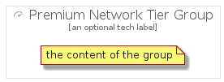

# PremiumNetworkTier


```text
gcp/Item/Networking/PremiumNetworkTier
```

```text
include('gcp/Item/Networking/PremiumNetworkTier')
```


| Illustration | PremiumNetworkTier | PremiumNetworkTierCard | PremiumNetworkTierGroup |
| :---: | :---: | :---: | :---: |
|  |  |  |  |


## PremiumNetworkTier

### Load remotely
```plantuml
@startuml
' configures the library
!global $LIB_BASE_LOCATION="https://github.com/tmorin/plantuml-libs/distribution"

' loads the library's bootstrap
!include $LIB_BASE_LOCATION/bootstrap.puml

' loads the package bootstrap
include('gcp/bootstrap')

' loads the Item which embeds the element PremiumNetworkTier
include('gcp/Item/Networking/PremiumNetworkTier')

' renders the element
PremiumNetworkTier('PremiumNetworkTier', 'Premium Network Tier', 'an optional tech label')
@enduml
```

### Load locally
```plantuml
@startuml
' configures the library
!global $INCLUSION_MODE="local"
!global $LIB_BASE_LOCATION="../../.."

' loads the library's bootstrap
!include $LIB_BASE_LOCATION/bootstrap.puml

' loads the package bootstrap
include('gcp/bootstrap')

' loads the Item which embeds the element PremiumNetworkTier
include('gcp/Item/Networking/PremiumNetworkTier')

' renders the element
PremiumNetworkTier('PremiumNetworkTier', 'Premium Network Tier', 'an optional tech label')
@enduml
```

## PremiumNetworkTierCard

### Load remotely
```plantuml
@startuml
' configures the library
!global $LIB_BASE_LOCATION="https://github.com/tmorin/plantuml-libs/distribution"

' loads the library's bootstrap
!include $LIB_BASE_LOCATION/bootstrap.puml

' loads the package bootstrap
include('gcp/bootstrap')

' loads the Item which embeds the element PremiumNetworkTierCard
include('gcp/Item/Networking/PremiumNetworkTier')

' renders the element
PremiumNetworkTierCard('PremiumNetworkTierCard', 'Premium Network Tier Card', 'an optional description')
@enduml
```

### Load locally
```plantuml
@startuml
' configures the library
!global $INCLUSION_MODE="local"
!global $LIB_BASE_LOCATION="../../.."

' loads the library's bootstrap
!include $LIB_BASE_LOCATION/bootstrap.puml

' loads the package bootstrap
include('gcp/bootstrap')

' loads the Item which embeds the element PremiumNetworkTierCard
include('gcp/Item/Networking/PremiumNetworkTier')

' renders the element
PremiumNetworkTierCard('PremiumNetworkTierCard', 'Premium Network Tier Card', 'an optional description')
@enduml
```

## PremiumNetworkTierGroup

### Load remotely
```plantuml
@startuml
' configures the library
!global $LIB_BASE_LOCATION="https://github.com/tmorin/plantuml-libs/distribution"

' loads the library's bootstrap
!include $LIB_BASE_LOCATION/bootstrap.puml

' loads the package bootstrap
include('gcp/bootstrap')

' loads the Item which embeds the element PremiumNetworkTierGroup
include('gcp/Item/Networking/PremiumNetworkTier')

' renders the element
PremiumNetworkTierGroup('PremiumNetworkTierGroup', 'Premium Network Tier Group', 'an optional tech label') {
    note as note
        the content of the group
    end note
}
@enduml
```

### Load locally
```plantuml
@startuml
' configures the library
!global $INCLUSION_MODE="local"
!global $LIB_BASE_LOCATION="../../.."

' loads the library's bootstrap
!include $LIB_BASE_LOCATION/bootstrap.puml

' loads the package bootstrap
include('gcp/bootstrap')

' loads the Item which embeds the element PremiumNetworkTierGroup
include('gcp/Item/Networking/PremiumNetworkTier')

' renders the element
PremiumNetworkTierGroup('PremiumNetworkTierGroup', 'Premium Network Tier Group', 'an optional tech label') {
    note as note
        the content of the group
    end note
}
@enduml
```

