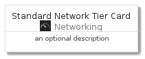
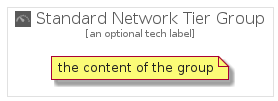

# StandardNetworkTier


```text
gcp/Item/Networking/StandardNetworkTier
```

```text
include('gcp/Item/Networking/StandardNetworkTier')
```


| Illustration | StandardNetworkTier | StandardNetworkTierCard | StandardNetworkTierGroup |
| :---: | :---: | :---: | :---: |
|  |  |  |  |


## StandardNetworkTier

### Load remotely
```plantuml
@startuml
' configures the library
!global $LIB_BASE_LOCATION="https://raw.githubusercontent.com/tmorin/plantuml-libs/master/distribution"

' loads the library's bootstrap
!include $LIB_BASE_LOCATION/bootstrap.puml

' loads the package bootstrap
include('gcp/bootstrap')

' loads the Item which embeds the element StandardNetworkTier
include('gcp/Item/Networking/StandardNetworkTier')

' renders the element
StandardNetworkTier('StandardNetworkTier', 'Standard Network Tier', 'an optional tech label')
@enduml
```

### Load locally
```plantuml
@startuml
' configures the library
!global $INCLUSION_MODE="local"
!global $LIB_BASE_LOCATION="../../.."

' loads the library's bootstrap
!include $LIB_BASE_LOCATION/bootstrap.puml

' loads the package bootstrap
include('gcp/bootstrap')

' loads the Item which embeds the element StandardNetworkTier
include('gcp/Item/Networking/StandardNetworkTier')

' renders the element
StandardNetworkTier('StandardNetworkTier', 'Standard Network Tier', 'an optional tech label')
@enduml
```

## StandardNetworkTierCard

### Load remotely
```plantuml
@startuml
' configures the library
!global $LIB_BASE_LOCATION="https://raw.githubusercontent.com/tmorin/plantuml-libs/master/distribution"

' loads the library's bootstrap
!include $LIB_BASE_LOCATION/bootstrap.puml

' loads the package bootstrap
include('gcp/bootstrap')

' loads the Item which embeds the element StandardNetworkTierCard
include('gcp/Item/Networking/StandardNetworkTier')

' renders the element
StandardNetworkTierCard('StandardNetworkTierCard', 'Standard Network Tier Card', 'an optional description')
@enduml
```

### Load locally
```plantuml
@startuml
' configures the library
!global $INCLUSION_MODE="local"
!global $LIB_BASE_LOCATION="../../.."

' loads the library's bootstrap
!include $LIB_BASE_LOCATION/bootstrap.puml

' loads the package bootstrap
include('gcp/bootstrap')

' loads the Item which embeds the element StandardNetworkTierCard
include('gcp/Item/Networking/StandardNetworkTier')

' renders the element
StandardNetworkTierCard('StandardNetworkTierCard', 'Standard Network Tier Card', 'an optional description')
@enduml
```

## StandardNetworkTierGroup

### Load remotely
```plantuml
@startuml
' configures the library
!global $LIB_BASE_LOCATION="https://raw.githubusercontent.com/tmorin/plantuml-libs/master/distribution"

' loads the library's bootstrap
!include $LIB_BASE_LOCATION/bootstrap.puml

' loads the package bootstrap
include('gcp/bootstrap')

' loads the Item which embeds the element StandardNetworkTierGroup
include('gcp/Item/Networking/StandardNetworkTier')

' renders the element
StandardNetworkTierGroup('StandardNetworkTierGroup', 'Standard Network Tier Group', 'an optional tech label') {
    note as note
        the content of the group
    end note
}
@enduml
```

### Load locally
```plantuml
@startuml
' configures the library
!global $INCLUSION_MODE="local"
!global $LIB_BASE_LOCATION="../../.."

' loads the library's bootstrap
!include $LIB_BASE_LOCATION/bootstrap.puml

' loads the package bootstrap
include('gcp/bootstrap')

' loads the Item which embeds the element StandardNetworkTierGroup
include('gcp/Item/Networking/StandardNetworkTier')

' renders the element
StandardNetworkTierGroup('StandardNetworkTierGroup', 'Standard Network Tier Group', 'an optional tech label') {
    note as note
        the content of the group
    end note
}
@enduml
```

