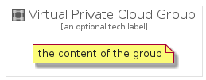

# VirtualPrivateCloud


```text
gcp/Item/Networking/VirtualPrivateCloud
```

```text
include('gcp/Item/Networking/VirtualPrivateCloud')
```


| Illustration | VirtualPrivateCloud | VirtualPrivateCloudCard | VirtualPrivateCloudGroup |
| :---: | :---: | :---: | :---: |
|  |  |  |  |


## VirtualPrivateCloud

### Load remotely
```plantuml
@startuml
' configures the library
!global $LIB_BASE_LOCATION="https://raw.githubusercontent.com/tmorin/plantuml-libs/master/distribution"

' loads the library's bootstrap
!include $LIB_BASE_LOCATION/bootstrap.puml

' loads the package bootstrap
include('gcp/bootstrap')

' loads the Item which embeds the element VirtualPrivateCloud
include('gcp/Item/Networking/VirtualPrivateCloud')

' renders the element
VirtualPrivateCloud('VirtualPrivateCloud', 'Virtual Private Cloud', 'an optional tech label')
@enduml
```

### Load locally
```plantuml
@startuml
' configures the library
!global $INCLUSION_MODE="local"
!global $LIB_BASE_LOCATION="../../.."

' loads the library's bootstrap
!include $LIB_BASE_LOCATION/bootstrap.puml

' loads the package bootstrap
include('gcp/bootstrap')

' loads the Item which embeds the element VirtualPrivateCloud
include('gcp/Item/Networking/VirtualPrivateCloud')

' renders the element
VirtualPrivateCloud('VirtualPrivateCloud', 'Virtual Private Cloud', 'an optional tech label')
@enduml
```

## VirtualPrivateCloudCard

### Load remotely
```plantuml
@startuml
' configures the library
!global $LIB_BASE_LOCATION="https://raw.githubusercontent.com/tmorin/plantuml-libs/master/distribution"

' loads the library's bootstrap
!include $LIB_BASE_LOCATION/bootstrap.puml

' loads the package bootstrap
include('gcp/bootstrap')

' loads the Item which embeds the element VirtualPrivateCloudCard
include('gcp/Item/Networking/VirtualPrivateCloud')

' renders the element
VirtualPrivateCloudCard('VirtualPrivateCloudCard', 'Virtual Private Cloud Card', 'an optional description')
@enduml
```

### Load locally
```plantuml
@startuml
' configures the library
!global $INCLUSION_MODE="local"
!global $LIB_BASE_LOCATION="../../.."

' loads the library's bootstrap
!include $LIB_BASE_LOCATION/bootstrap.puml

' loads the package bootstrap
include('gcp/bootstrap')

' loads the Item which embeds the element VirtualPrivateCloudCard
include('gcp/Item/Networking/VirtualPrivateCloud')

' renders the element
VirtualPrivateCloudCard('VirtualPrivateCloudCard', 'Virtual Private Cloud Card', 'an optional description')
@enduml
```

## VirtualPrivateCloudGroup

### Load remotely
```plantuml
@startuml
' configures the library
!global $LIB_BASE_LOCATION="https://raw.githubusercontent.com/tmorin/plantuml-libs/master/distribution"

' loads the library's bootstrap
!include $LIB_BASE_LOCATION/bootstrap.puml

' loads the package bootstrap
include('gcp/bootstrap')

' loads the Item which embeds the element VirtualPrivateCloudGroup
include('gcp/Item/Networking/VirtualPrivateCloud')

' renders the element
VirtualPrivateCloudGroup('VirtualPrivateCloudGroup', 'Virtual Private Cloud Group', 'an optional tech label') {
    note as note
        the content of the group
    end note
}
@enduml
```

### Load locally
```plantuml
@startuml
' configures the library
!global $INCLUSION_MODE="local"
!global $LIB_BASE_LOCATION="../../.."

' loads the library's bootstrap
!include $LIB_BASE_LOCATION/bootstrap.puml

' loads the package bootstrap
include('gcp/bootstrap')

' loads the Item which embeds the element VirtualPrivateCloudGroup
include('gcp/Item/Networking/VirtualPrivateCloud')

' renders the element
VirtualPrivateCloudGroup('VirtualPrivateCloudGroup', 'Virtual Private Cloud Group', 'an optional tech label') {
    note as note
        the content of the group
    end note
}
@enduml
```

