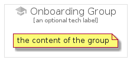

# Onboarding


```text
gcp/Item/Onboarding
```

```text
include('gcp/Item/Onboarding')
```


| Illustration | Onboarding | OnboardingCard | OnboardingGroup |
| :---: | :---: | :---: | :---: |
|  |  |  |  |


## Sprites
The item provides the following sriptes:

- `<$OnboardingXs>`
- `<$OnboardingSm>`
- `<$OnboardingMd>`
- `<$OnboardingLg>`


## Onboarding

### Load remotely
```plantuml
@startuml
' configures the library
!global $LIB_BASE_LOCATION="https://raw.githubusercontent.com/tmorin/plantuml-libs/master/distribution"

' loads the library's bootstrap
!include $LIB_BASE_LOCATION/bootstrap.puml

' loads the package bootstrap
include('gcp/bootstrap')

' loads the Item which embeds the element Onboarding
include('gcp/Item/Onboarding')

' renders the element
Onboarding('Onboarding', 'Onboarding', 'an optional tech label', 'an optional description')
@enduml
```

### Load locally
```plantuml
@startuml
' configures the library
!global $INCLUSION_MODE="local"
!global $LIB_BASE_LOCATION="../.."

' loads the library's bootstrap
!include $LIB_BASE_LOCATION/bootstrap.puml

' loads the package bootstrap
include('gcp/bootstrap')

' loads the Item which embeds the element Onboarding
include('gcp/Item/Onboarding')

' renders the element
Onboarding('Onboarding', 'Onboarding', 'an optional tech label', 'an optional description')
@enduml
```

## OnboardingCard

### Load remotely
```plantuml
@startuml
' configures the library
!global $LIB_BASE_LOCATION="https://raw.githubusercontent.com/tmorin/plantuml-libs/master/distribution"

' loads the library's bootstrap
!include $LIB_BASE_LOCATION/bootstrap.puml

' loads the package bootstrap
include('gcp/bootstrap')

' loads the Item which embeds the element OnboardingCard
include('gcp/Item/Onboarding')

' renders the element
OnboardingCard('OnboardingCard', 'Onboarding Card', 'an optional description')
@enduml
```

### Load locally
```plantuml
@startuml
' configures the library
!global $INCLUSION_MODE="local"
!global $LIB_BASE_LOCATION="../.."

' loads the library's bootstrap
!include $LIB_BASE_LOCATION/bootstrap.puml

' loads the package bootstrap
include('gcp/bootstrap')

' loads the Item which embeds the element OnboardingCard
include('gcp/Item/Onboarding')

' renders the element
OnboardingCard('OnboardingCard', 'Onboarding Card', 'an optional description')
@enduml
```

## OnboardingGroup

### Load remotely
```plantuml
@startuml
' configures the library
!global $LIB_BASE_LOCATION="https://raw.githubusercontent.com/tmorin/plantuml-libs/master/distribution"

' loads the library's bootstrap
!include $LIB_BASE_LOCATION/bootstrap.puml

' loads the package bootstrap
include('gcp/bootstrap')

' loads the Item which embeds the element OnboardingGroup
include('gcp/Item/Onboarding')

' renders the element
OnboardingGroup('OnboardingGroup', 'Onboarding Group', 'an optional tech label') {
    note as note
        the content of the group
    end note
}
@enduml
```

### Load locally
```plantuml
@startuml
' configures the library
!global $INCLUSION_MODE="local"
!global $LIB_BASE_LOCATION="../.."

' loads the library's bootstrap
!include $LIB_BASE_LOCATION/bootstrap.puml

' loads the package bootstrap
include('gcp/bootstrap')

' loads the Item which embeds the element OnboardingGroup
include('gcp/Item/Onboarding')

' renders the element
OnboardingGroup('OnboardingGroup', 'Onboarding Group', 'an optional tech label') {
    note as note
        the content of the group
    end note
}
@enduml
```

