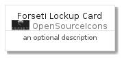
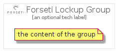

# ForsetiLockup


```text
gcp/Item/OpenSourceIcons/ForsetiLockup
```

```text
include('gcp/Item/OpenSourceIcons/ForsetiLockup')
```


| Illustration | ForsetiLockup | ForsetiLockupCard | ForsetiLockupGroup |
| :---: | :---: | :---: | :---: |
|  |  |  |  |


## ForsetiLockup

### Load remotely
```plantuml
@startuml
' configures the library
!global $LIB_BASE_LOCATION="https://raw.githubusercontent.com/tmorin/plantuml-libs/master/distribution"

' loads the library's bootstrap
!include $LIB_BASE_LOCATION/bootstrap.puml

' loads the package bootstrap
include('gcp/bootstrap')

' loads the Item which embeds the element ForsetiLockup
include('gcp/Item/OpenSourceIcons/ForsetiLockup')

' renders the element
ForsetiLockup('ForsetiLockup', 'Forseti Lockup', 'an optional tech label')
@enduml
```

### Load locally
```plantuml
@startuml
' configures the library
!global $INCLUSION_MODE="local"
!global $LIB_BASE_LOCATION="../../.."

' loads the library's bootstrap
!include $LIB_BASE_LOCATION/bootstrap.puml

' loads the package bootstrap
include('gcp/bootstrap')

' loads the Item which embeds the element ForsetiLockup
include('gcp/Item/OpenSourceIcons/ForsetiLockup')

' renders the element
ForsetiLockup('ForsetiLockup', 'Forseti Lockup', 'an optional tech label')
@enduml
```

## ForsetiLockupCard

### Load remotely
```plantuml
@startuml
' configures the library
!global $LIB_BASE_LOCATION="https://raw.githubusercontent.com/tmorin/plantuml-libs/master/distribution"

' loads the library's bootstrap
!include $LIB_BASE_LOCATION/bootstrap.puml

' loads the package bootstrap
include('gcp/bootstrap')

' loads the Item which embeds the element ForsetiLockupCard
include('gcp/Item/OpenSourceIcons/ForsetiLockup')

' renders the element
ForsetiLockupCard('ForsetiLockupCard', 'Forseti Lockup Card', 'an optional description')
@enduml
```

### Load locally
```plantuml
@startuml
' configures the library
!global $INCLUSION_MODE="local"
!global $LIB_BASE_LOCATION="../../.."

' loads the library's bootstrap
!include $LIB_BASE_LOCATION/bootstrap.puml

' loads the package bootstrap
include('gcp/bootstrap')

' loads the Item which embeds the element ForsetiLockupCard
include('gcp/Item/OpenSourceIcons/ForsetiLockup')

' renders the element
ForsetiLockupCard('ForsetiLockupCard', 'Forseti Lockup Card', 'an optional description')
@enduml
```

## ForsetiLockupGroup

### Load remotely
```plantuml
@startuml
' configures the library
!global $LIB_BASE_LOCATION="https://raw.githubusercontent.com/tmorin/plantuml-libs/master/distribution"

' loads the library's bootstrap
!include $LIB_BASE_LOCATION/bootstrap.puml

' loads the package bootstrap
include('gcp/bootstrap')

' loads the Item which embeds the element ForsetiLockupGroup
include('gcp/Item/OpenSourceIcons/ForsetiLockup')

' renders the element
ForsetiLockupGroup('ForsetiLockupGroup', 'Forseti Lockup Group', 'an optional tech label') {
    note as note
        the content of the group
    end note
}
@enduml
```

### Load locally
```plantuml
@startuml
' configures the library
!global $INCLUSION_MODE="local"
!global $LIB_BASE_LOCATION="../../.."

' loads the library's bootstrap
!include $LIB_BASE_LOCATION/bootstrap.puml

' loads the package bootstrap
include('gcp/bootstrap')

' loads the Item which embeds the element ForsetiLockupGroup
include('gcp/Item/OpenSourceIcons/ForsetiLockup')

' renders the element
ForsetiLockupGroup('ForsetiLockupGroup', 'Forseti Lockup Group', 'an optional tech label') {
    note as note
        the content of the group
    end note
}
@enduml
```

