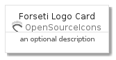
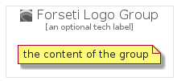

# ForsetiLogo


```text
gcp/Item/OpenSourceIcons/ForsetiLogo
```

```text
include('gcp/Item/OpenSourceIcons/ForsetiLogo')
```


| Illustration | ForsetiLogo | ForsetiLogoCard | ForsetiLogoGroup |
| :---: | :---: | :---: | :---: |
|  |  |  |  |


## ForsetiLogo

### Load remotely
```plantuml
@startuml
' configures the library
!global $LIB_BASE_LOCATION="https://github.com/tmorin/plantuml-libs/distribution"

' loads the library's bootstrap
!include $LIB_BASE_LOCATION/bootstrap.puml

' loads the package bootstrap
include('gcp/bootstrap')

' loads the Item which embeds the element ForsetiLogo
include('gcp/Item/OpenSourceIcons/ForsetiLogo')

' renders the element
ForsetiLogo('ForsetiLogo', 'Forseti Logo', 'an optional tech label')
@enduml
```

### Load locally
```plantuml
@startuml
' configures the library
!global $INCLUSION_MODE="local"
!global $LIB_BASE_LOCATION="../../.."

' loads the library's bootstrap
!include $LIB_BASE_LOCATION/bootstrap.puml

' loads the package bootstrap
include('gcp/bootstrap')

' loads the Item which embeds the element ForsetiLogo
include('gcp/Item/OpenSourceIcons/ForsetiLogo')

' renders the element
ForsetiLogo('ForsetiLogo', 'Forseti Logo', 'an optional tech label')
@enduml
```

## ForsetiLogoCard

### Load remotely
```plantuml
@startuml
' configures the library
!global $LIB_BASE_LOCATION="https://github.com/tmorin/plantuml-libs/distribution"

' loads the library's bootstrap
!include $LIB_BASE_LOCATION/bootstrap.puml

' loads the package bootstrap
include('gcp/bootstrap')

' loads the Item which embeds the element ForsetiLogoCard
include('gcp/Item/OpenSourceIcons/ForsetiLogo')

' renders the element
ForsetiLogoCard('ForsetiLogoCard', 'Forseti Logo Card', 'an optional description')
@enduml
```

### Load locally
```plantuml
@startuml
' configures the library
!global $INCLUSION_MODE="local"
!global $LIB_BASE_LOCATION="../../.."

' loads the library's bootstrap
!include $LIB_BASE_LOCATION/bootstrap.puml

' loads the package bootstrap
include('gcp/bootstrap')

' loads the Item which embeds the element ForsetiLogoCard
include('gcp/Item/OpenSourceIcons/ForsetiLogo')

' renders the element
ForsetiLogoCard('ForsetiLogoCard', 'Forseti Logo Card', 'an optional description')
@enduml
```

## ForsetiLogoGroup

### Load remotely
```plantuml
@startuml
' configures the library
!global $LIB_BASE_LOCATION="https://github.com/tmorin/plantuml-libs/distribution"

' loads the library's bootstrap
!include $LIB_BASE_LOCATION/bootstrap.puml

' loads the package bootstrap
include('gcp/bootstrap')

' loads the Item which embeds the element ForsetiLogoGroup
include('gcp/Item/OpenSourceIcons/ForsetiLogo')

' renders the element
ForsetiLogoGroup('ForsetiLogoGroup', 'Forseti Logo Group', 'an optional tech label') {
    note as note
        the content of the group
    end note
}
@enduml
```

### Load locally
```plantuml
@startuml
' configures the library
!global $INCLUSION_MODE="local"
!global $LIB_BASE_LOCATION="../../.."

' loads the library's bootstrap
!include $LIB_BASE_LOCATION/bootstrap.puml

' loads the package bootstrap
include('gcp/bootstrap')

' loads the Item which embeds the element ForsetiLogoGroup
include('gcp/Item/OpenSourceIcons/ForsetiLogo')

' renders the element
ForsetiLogoGroup('ForsetiLogoGroup', 'Forseti Logo Group', 'an optional tech label') {
    note as note
        the content of the group
    end note
}
@enduml
```

