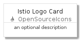
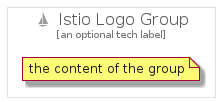

# IstioLogo


```text
gcp/Item/OpenSourceIcons/IstioLogo
```

```text
include('gcp/Item/OpenSourceIcons/IstioLogo')
```


| Illustration | IstioLogo | IstioLogoCard | IstioLogoGroup |
| :---: | :---: | :---: | :---: |
|  |  |  |  |


## IstioLogo

### Load remotely
```plantuml
@startuml
' configures the library
!global $LIB_BASE_LOCATION="https://github.com/tmorin/plantuml-libs/distribution"

' loads the library's bootstrap
!include $LIB_BASE_LOCATION/bootstrap.puml

' loads the package bootstrap
include('gcp/bootstrap')

' loads the Item which embeds the element IstioLogo
include('gcp/Item/OpenSourceIcons/IstioLogo')

' renders the element
IstioLogo('IstioLogo', 'Istio Logo', 'an optional tech label')
@enduml
```

### Load locally
```plantuml
@startuml
' configures the library
!global $INCLUSION_MODE="local"
!global $LIB_BASE_LOCATION="../../.."

' loads the library's bootstrap
!include $LIB_BASE_LOCATION/bootstrap.puml

' loads the package bootstrap
include('gcp/bootstrap')

' loads the Item which embeds the element IstioLogo
include('gcp/Item/OpenSourceIcons/IstioLogo')

' renders the element
IstioLogo('IstioLogo', 'Istio Logo', 'an optional tech label')
@enduml
```

## IstioLogoCard

### Load remotely
```plantuml
@startuml
' configures the library
!global $LIB_BASE_LOCATION="https://github.com/tmorin/plantuml-libs/distribution"

' loads the library's bootstrap
!include $LIB_BASE_LOCATION/bootstrap.puml

' loads the package bootstrap
include('gcp/bootstrap')

' loads the Item which embeds the element IstioLogoCard
include('gcp/Item/OpenSourceIcons/IstioLogo')

' renders the element
IstioLogoCard('IstioLogoCard', 'Istio Logo Card', 'an optional description')
@enduml
```

### Load locally
```plantuml
@startuml
' configures the library
!global $INCLUSION_MODE="local"
!global $LIB_BASE_LOCATION="../../.."

' loads the library's bootstrap
!include $LIB_BASE_LOCATION/bootstrap.puml

' loads the package bootstrap
include('gcp/bootstrap')

' loads the Item which embeds the element IstioLogoCard
include('gcp/Item/OpenSourceIcons/IstioLogo')

' renders the element
IstioLogoCard('IstioLogoCard', 'Istio Logo Card', 'an optional description')
@enduml
```

## IstioLogoGroup

### Load remotely
```plantuml
@startuml
' configures the library
!global $LIB_BASE_LOCATION="https://github.com/tmorin/plantuml-libs/distribution"

' loads the library's bootstrap
!include $LIB_BASE_LOCATION/bootstrap.puml

' loads the package bootstrap
include('gcp/bootstrap')

' loads the Item which embeds the element IstioLogoGroup
include('gcp/Item/OpenSourceIcons/IstioLogo')

' renders the element
IstioLogoGroup('IstioLogoGroup', 'Istio Logo Group', 'an optional tech label') {
    note as note
        the content of the group
    end note
}
@enduml
```

### Load locally
```plantuml
@startuml
' configures the library
!global $INCLUSION_MODE="local"
!global $LIB_BASE_LOCATION="../../.."

' loads the library's bootstrap
!include $LIB_BASE_LOCATION/bootstrap.puml

' loads the package bootstrap
include('gcp/bootstrap')

' loads the Item which embeds the element IstioLogoGroup
include('gcp/Item/OpenSourceIcons/IstioLogo')

' renders the element
IstioLogoGroup('IstioLogoGroup', 'Istio Logo Group', 'an optional tech label') {
    note as note
        the content of the group
    end note
}
@enduml
```

