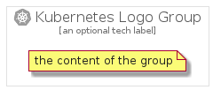

# KubernetesLogo


```text
gcp/Item/OpenSourceIcons/KubernetesLogo
```

```text
include('gcp/Item/OpenSourceIcons/KubernetesLogo')
```


| Illustration | KubernetesLogo | KubernetesLogoCard | KubernetesLogoGroup |
| :---: | :---: | :---: | :---: |
|  |  |  |  |


## KubernetesLogo

### Load remotely
```plantuml
@startuml
' configures the library
!global $LIB_BASE_LOCATION="https://raw.githubusercontent.com/tmorin/plantuml-libs/master/distribution"

' loads the library's bootstrap
!include $LIB_BASE_LOCATION/bootstrap.puml

' loads the package bootstrap
include('gcp/bootstrap')

' loads the Item which embeds the element KubernetesLogo
include('gcp/Item/OpenSourceIcons/KubernetesLogo')

' renders the element
KubernetesLogo('KubernetesLogo', 'Kubernetes Logo', 'an optional tech label')
@enduml
```

### Load locally
```plantuml
@startuml
' configures the library
!global $INCLUSION_MODE="local"
!global $LIB_BASE_LOCATION="../../.."

' loads the library's bootstrap
!include $LIB_BASE_LOCATION/bootstrap.puml

' loads the package bootstrap
include('gcp/bootstrap')

' loads the Item which embeds the element KubernetesLogo
include('gcp/Item/OpenSourceIcons/KubernetesLogo')

' renders the element
KubernetesLogo('KubernetesLogo', 'Kubernetes Logo', 'an optional tech label')
@enduml
```

## KubernetesLogoCard

### Load remotely
```plantuml
@startuml
' configures the library
!global $LIB_BASE_LOCATION="https://raw.githubusercontent.com/tmorin/plantuml-libs/master/distribution"

' loads the library's bootstrap
!include $LIB_BASE_LOCATION/bootstrap.puml

' loads the package bootstrap
include('gcp/bootstrap')

' loads the Item which embeds the element KubernetesLogoCard
include('gcp/Item/OpenSourceIcons/KubernetesLogo')

' renders the element
KubernetesLogoCard('KubernetesLogoCard', 'Kubernetes Logo Card', 'an optional description')
@enduml
```

### Load locally
```plantuml
@startuml
' configures the library
!global $INCLUSION_MODE="local"
!global $LIB_BASE_LOCATION="../../.."

' loads the library's bootstrap
!include $LIB_BASE_LOCATION/bootstrap.puml

' loads the package bootstrap
include('gcp/bootstrap')

' loads the Item which embeds the element KubernetesLogoCard
include('gcp/Item/OpenSourceIcons/KubernetesLogo')

' renders the element
KubernetesLogoCard('KubernetesLogoCard', 'Kubernetes Logo Card', 'an optional description')
@enduml
```

## KubernetesLogoGroup

### Load remotely
```plantuml
@startuml
' configures the library
!global $LIB_BASE_LOCATION="https://raw.githubusercontent.com/tmorin/plantuml-libs/master/distribution"

' loads the library's bootstrap
!include $LIB_BASE_LOCATION/bootstrap.puml

' loads the package bootstrap
include('gcp/bootstrap')

' loads the Item which embeds the element KubernetesLogoGroup
include('gcp/Item/OpenSourceIcons/KubernetesLogo')

' renders the element
KubernetesLogoGroup('KubernetesLogoGroup', 'Kubernetes Logo Group', 'an optional tech label') {
    note as note
        the content of the group
    end note
}
@enduml
```

### Load locally
```plantuml
@startuml
' configures the library
!global $INCLUSION_MODE="local"
!global $LIB_BASE_LOCATION="../../.."

' loads the library's bootstrap
!include $LIB_BASE_LOCATION/bootstrap.puml

' loads the package bootstrap
include('gcp/bootstrap')

' loads the Item which embeds the element KubernetesLogoGroup
include('gcp/Item/OpenSourceIcons/KubernetesLogo')

' renders the element
KubernetesLogoGroup('KubernetesLogoGroup', 'Kubernetes Logo Group', 'an optional tech label') {
    note as note
        the content of the group
    end note
}
@enduml
```

