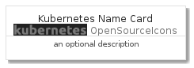
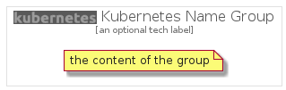

# KubernetesName


```text
gcp/Item/OpenSourceIcons/KubernetesName
```

```text
include('gcp/Item/OpenSourceIcons/KubernetesName')
```


| Illustration | KubernetesName | KubernetesNameCard | KubernetesNameGroup |
| :---: | :---: | :---: | :---: |
|  |  |  |  |


## KubernetesName

### Load remotely
```plantuml
@startuml
' configures the library
!global $LIB_BASE_LOCATION="https://github.com/tmorin/plantuml-libs/distribution"

' loads the library's bootstrap
!include $LIB_BASE_LOCATION/bootstrap.puml

' loads the package bootstrap
include('gcp/bootstrap')

' loads the Item which embeds the element KubernetesName
include('gcp/Item/OpenSourceIcons/KubernetesName')

' renders the element
KubernetesName('KubernetesName', 'Kubernetes Name', 'an optional tech label')
@enduml
```

### Load locally
```plantuml
@startuml
' configures the library
!global $INCLUSION_MODE="local"
!global $LIB_BASE_LOCATION="../../.."

' loads the library's bootstrap
!include $LIB_BASE_LOCATION/bootstrap.puml

' loads the package bootstrap
include('gcp/bootstrap')

' loads the Item which embeds the element KubernetesName
include('gcp/Item/OpenSourceIcons/KubernetesName')

' renders the element
KubernetesName('KubernetesName', 'Kubernetes Name', 'an optional tech label')
@enduml
```

## KubernetesNameCard

### Load remotely
```plantuml
@startuml
' configures the library
!global $LIB_BASE_LOCATION="https://github.com/tmorin/plantuml-libs/distribution"

' loads the library's bootstrap
!include $LIB_BASE_LOCATION/bootstrap.puml

' loads the package bootstrap
include('gcp/bootstrap')

' loads the Item which embeds the element KubernetesNameCard
include('gcp/Item/OpenSourceIcons/KubernetesName')

' renders the element
KubernetesNameCard('KubernetesNameCard', 'Kubernetes Name Card', 'an optional description')
@enduml
```

### Load locally
```plantuml
@startuml
' configures the library
!global $INCLUSION_MODE="local"
!global $LIB_BASE_LOCATION="../../.."

' loads the library's bootstrap
!include $LIB_BASE_LOCATION/bootstrap.puml

' loads the package bootstrap
include('gcp/bootstrap')

' loads the Item which embeds the element KubernetesNameCard
include('gcp/Item/OpenSourceIcons/KubernetesName')

' renders the element
KubernetesNameCard('KubernetesNameCard', 'Kubernetes Name Card', 'an optional description')
@enduml
```

## KubernetesNameGroup

### Load remotely
```plantuml
@startuml
' configures the library
!global $LIB_BASE_LOCATION="https://github.com/tmorin/plantuml-libs/distribution"

' loads the library's bootstrap
!include $LIB_BASE_LOCATION/bootstrap.puml

' loads the package bootstrap
include('gcp/bootstrap')

' loads the Item which embeds the element KubernetesNameGroup
include('gcp/Item/OpenSourceIcons/KubernetesName')

' renders the element
KubernetesNameGroup('KubernetesNameGroup', 'Kubernetes Name Group', 'an optional tech label') {
    note as note
        the content of the group
    end note
}
@enduml
```

### Load locally
```plantuml
@startuml
' configures the library
!global $INCLUSION_MODE="local"
!global $LIB_BASE_LOCATION="../../.."

' loads the library's bootstrap
!include $LIB_BASE_LOCATION/bootstrap.puml

' loads the package bootstrap
include('gcp/bootstrap')

' loads the Item which embeds the element KubernetesNameGroup
include('gcp/Item/OpenSourceIcons/KubernetesName')

' renders the element
KubernetesNameGroup('KubernetesNameGroup', 'Kubernetes Name Group', 'an optional tech label') {
    note as note
        the content of the group
    end note
}
@enduml
```

