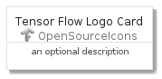
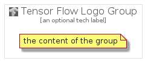

# TensorFlowLogo


```text
gcp/Item/OpenSourceIcons/TensorFlowLogo
```

```text
include('gcp/Item/OpenSourceIcons/TensorFlowLogo')
```


| Illustration | TensorFlowLogo | TensorFlowLogoCard | TensorFlowLogoGroup |
| :---: | :---: | :---: | :---: |
|  |  |  |  |


## TensorFlowLogo

### Load remotely
```plantuml
@startuml
' configures the library
!global $LIB_BASE_LOCATION="https://github.com/tmorin/plantuml-libs/distribution"

' loads the library's bootstrap
!include $LIB_BASE_LOCATION/bootstrap.puml

' loads the package bootstrap
include('gcp/bootstrap')

' loads the Item which embeds the element TensorFlowLogo
include('gcp/Item/OpenSourceIcons/TensorFlowLogo')

' renders the element
TensorFlowLogo('TensorFlowLogo', 'Tensor Flow Logo', 'an optional tech label')
@enduml
```

### Load locally
```plantuml
@startuml
' configures the library
!global $INCLUSION_MODE="local"
!global $LIB_BASE_LOCATION="../../.."

' loads the library's bootstrap
!include $LIB_BASE_LOCATION/bootstrap.puml

' loads the package bootstrap
include('gcp/bootstrap')

' loads the Item which embeds the element TensorFlowLogo
include('gcp/Item/OpenSourceIcons/TensorFlowLogo')

' renders the element
TensorFlowLogo('TensorFlowLogo', 'Tensor Flow Logo', 'an optional tech label')
@enduml
```

## TensorFlowLogoCard

### Load remotely
```plantuml
@startuml
' configures the library
!global $LIB_BASE_LOCATION="https://github.com/tmorin/plantuml-libs/distribution"

' loads the library's bootstrap
!include $LIB_BASE_LOCATION/bootstrap.puml

' loads the package bootstrap
include('gcp/bootstrap')

' loads the Item which embeds the element TensorFlowLogoCard
include('gcp/Item/OpenSourceIcons/TensorFlowLogo')

' renders the element
TensorFlowLogoCard('TensorFlowLogoCard', 'Tensor Flow Logo Card', 'an optional description')
@enduml
```

### Load locally
```plantuml
@startuml
' configures the library
!global $INCLUSION_MODE="local"
!global $LIB_BASE_LOCATION="../../.."

' loads the library's bootstrap
!include $LIB_BASE_LOCATION/bootstrap.puml

' loads the package bootstrap
include('gcp/bootstrap')

' loads the Item which embeds the element TensorFlowLogoCard
include('gcp/Item/OpenSourceIcons/TensorFlowLogo')

' renders the element
TensorFlowLogoCard('TensorFlowLogoCard', 'Tensor Flow Logo Card', 'an optional description')
@enduml
```

## TensorFlowLogoGroup

### Load remotely
```plantuml
@startuml
' configures the library
!global $LIB_BASE_LOCATION="https://github.com/tmorin/plantuml-libs/distribution"

' loads the library's bootstrap
!include $LIB_BASE_LOCATION/bootstrap.puml

' loads the package bootstrap
include('gcp/bootstrap')

' loads the Item which embeds the element TensorFlowLogoGroup
include('gcp/Item/OpenSourceIcons/TensorFlowLogo')

' renders the element
TensorFlowLogoGroup('TensorFlowLogoGroup', 'Tensor Flow Logo Group', 'an optional tech label') {
    note as note
        the content of the group
    end note
}
@enduml
```

### Load locally
```plantuml
@startuml
' configures the library
!global $INCLUSION_MODE="local"
!global $LIB_BASE_LOCATION="../../.."

' loads the library's bootstrap
!include $LIB_BASE_LOCATION/bootstrap.puml

' loads the package bootstrap
include('gcp/bootstrap')

' loads the Item which embeds the element TensorFlowLogoGroup
include('gcp/Item/OpenSourceIcons/TensorFlowLogo')

' renders the element
TensorFlowLogoGroup('TensorFlowLogoGroup', 'Tensor Flow Logo Group', 'an optional tech label') {
    note as note
        the content of the group
    end note
}
@enduml
```

