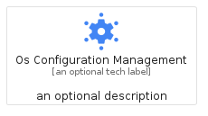
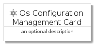
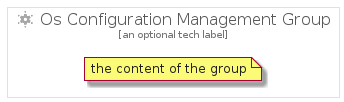

# OsConfigurationManagement


```text
gcp/Item/OsConfigurationManagement
```

```text
include('gcp/Item/OsConfigurationManagement')
```


| Illustration | OsConfigurationManagement | OsConfigurationManagementCard | OsConfigurationManagementGroup |
| :---: | :---: | :---: | :---: |
|  |  |  |  |


## OsConfigurationManagement

### Load remotely
```plantuml
@startuml
' configures the library
!global $LIB_BASE_LOCATION="https://raw.githubusercontent.com/tmorin/plantuml-libs/master/distribution"

' loads the library's bootstrap
!include $LIB_BASE_LOCATION/bootstrap.puml

' loads the package bootstrap
include('gcp/bootstrap')

' loads the Item which embeds the element OsConfigurationManagement
include('gcp/Item/OsConfigurationManagement')

' renders the element
OsConfigurationManagement('OsConfigurationManagement', 'Os Configuration Management', 'an optional tech label', 'an optional description')
@enduml
```

### Load locally
```plantuml
@startuml
' configures the library
!global $INCLUSION_MODE="local"
!global $LIB_BASE_LOCATION="../.."

' loads the library's bootstrap
!include $LIB_BASE_LOCATION/bootstrap.puml

' loads the package bootstrap
include('gcp/bootstrap')

' loads the Item which embeds the element OsConfigurationManagement
include('gcp/Item/OsConfigurationManagement')

' renders the element
OsConfigurationManagement('OsConfigurationManagement', 'Os Configuration Management', 'an optional tech label', 'an optional description')
@enduml
```

## OsConfigurationManagementCard

### Load remotely
```plantuml
@startuml
' configures the library
!global $LIB_BASE_LOCATION="https://raw.githubusercontent.com/tmorin/plantuml-libs/master/distribution"

' loads the library's bootstrap
!include $LIB_BASE_LOCATION/bootstrap.puml

' loads the package bootstrap
include('gcp/bootstrap')

' loads the Item which embeds the element OsConfigurationManagementCard
include('gcp/Item/OsConfigurationManagement')

' renders the element
OsConfigurationManagementCard('OsConfigurationManagementCard', 'Os Configuration Management Card', 'an optional description')
@enduml
```

### Load locally
```plantuml
@startuml
' configures the library
!global $INCLUSION_MODE="local"
!global $LIB_BASE_LOCATION="../.."

' loads the library's bootstrap
!include $LIB_BASE_LOCATION/bootstrap.puml

' loads the package bootstrap
include('gcp/bootstrap')

' loads the Item which embeds the element OsConfigurationManagementCard
include('gcp/Item/OsConfigurationManagement')

' renders the element
OsConfigurationManagementCard('OsConfigurationManagementCard', 'Os Configuration Management Card', 'an optional description')
@enduml
```

## OsConfigurationManagementGroup

### Load remotely
```plantuml
@startuml
' configures the library
!global $LIB_BASE_LOCATION="https://raw.githubusercontent.com/tmorin/plantuml-libs/master/distribution"

' loads the library's bootstrap
!include $LIB_BASE_LOCATION/bootstrap.puml

' loads the package bootstrap
include('gcp/bootstrap')

' loads the Item which embeds the element OsConfigurationManagementGroup
include('gcp/Item/OsConfigurationManagement')

' renders the element
OsConfigurationManagementGroup('OsConfigurationManagementGroup', 'Os Configuration Management Group', 'an optional tech label') {
    note as note
        the content of the group
    end note
}
@enduml
```

### Load locally
```plantuml
@startuml
' configures the library
!global $INCLUSION_MODE="local"
!global $LIB_BASE_LOCATION="../.."

' loads the library's bootstrap
!include $LIB_BASE_LOCATION/bootstrap.puml

' loads the package bootstrap
include('gcp/bootstrap')

' loads the Item which embeds the element OsConfigurationManagementGroup
include('gcp/Item/OsConfigurationManagement')

' renders the element
OsConfigurationManagementGroup('OsConfigurationManagementGroup', 'Os Configuration Management Group', 'an optional tech label') {
    note as note
        the content of the group
    end note
}
@enduml
```

