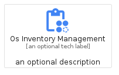
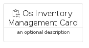
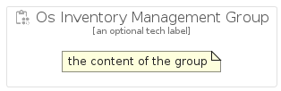

# OsInventoryManagement


```text
gcp/Item/OsInventoryManagement
```

```text
include('gcp/Item/OsInventoryManagement')
```


| Illustration | OsInventoryManagement | OsInventoryManagementCard | OsInventoryManagementGroup |
| :---: | :---: | :---: | :---: |
|  |  |  |  |


## Sprites
The item provides the following sriptes:

- `<$OsInventoryManagementXs>`
- `<$OsInventoryManagementSm>`
- `<$OsInventoryManagementMd>`
- `<$OsInventoryManagementLg>`


## OsInventoryManagement

### Load remotely
```plantuml
@startuml
' configures the library
!global $LIB_BASE_LOCATION="https://raw.githubusercontent.com/tmorin/plantuml-libs/master/distribution"

' loads the library's bootstrap
!include $LIB_BASE_LOCATION/bootstrap.puml

' loads the package bootstrap
include('gcp/bootstrap')

' loads the Item which embeds the element OsInventoryManagement
include('gcp/Item/OsInventoryManagement')

' renders the element
OsInventoryManagement('OsInventoryManagement', 'Os Inventory Management', 'an optional tech label', 'an optional description')
@enduml
```

### Load locally
```plantuml
@startuml
' configures the library
!global $INCLUSION_MODE="local"
!global $LIB_BASE_LOCATION="../.."

' loads the library's bootstrap
!include $LIB_BASE_LOCATION/bootstrap.puml

' loads the package bootstrap
include('gcp/bootstrap')

' loads the Item which embeds the element OsInventoryManagement
include('gcp/Item/OsInventoryManagement')

' renders the element
OsInventoryManagement('OsInventoryManagement', 'Os Inventory Management', 'an optional tech label', 'an optional description')
@enduml
```

## OsInventoryManagementCard

### Load remotely
```plantuml
@startuml
' configures the library
!global $LIB_BASE_LOCATION="https://raw.githubusercontent.com/tmorin/plantuml-libs/master/distribution"

' loads the library's bootstrap
!include $LIB_BASE_LOCATION/bootstrap.puml

' loads the package bootstrap
include('gcp/bootstrap')

' loads the Item which embeds the element OsInventoryManagementCard
include('gcp/Item/OsInventoryManagement')

' renders the element
OsInventoryManagementCard('OsInventoryManagementCard', 'Os Inventory Management Card', 'an optional description')
@enduml
```

### Load locally
```plantuml
@startuml
' configures the library
!global $INCLUSION_MODE="local"
!global $LIB_BASE_LOCATION="../.."

' loads the library's bootstrap
!include $LIB_BASE_LOCATION/bootstrap.puml

' loads the package bootstrap
include('gcp/bootstrap')

' loads the Item which embeds the element OsInventoryManagementCard
include('gcp/Item/OsInventoryManagement')

' renders the element
OsInventoryManagementCard('OsInventoryManagementCard', 'Os Inventory Management Card', 'an optional description')
@enduml
```

## OsInventoryManagementGroup

### Load remotely
```plantuml
@startuml
' configures the library
!global $LIB_BASE_LOCATION="https://raw.githubusercontent.com/tmorin/plantuml-libs/master/distribution"

' loads the library's bootstrap
!include $LIB_BASE_LOCATION/bootstrap.puml

' loads the package bootstrap
include('gcp/bootstrap')

' loads the Item which embeds the element OsInventoryManagementGroup
include('gcp/Item/OsInventoryManagement')

' renders the element
OsInventoryManagementGroup('OsInventoryManagementGroup', 'Os Inventory Management Group', 'an optional tech label') {
    note as note
        the content of the group
    end note
}
@enduml
```

### Load locally
```plantuml
@startuml
' configures the library
!global $INCLUSION_MODE="local"
!global $LIB_BASE_LOCATION="../.."

' loads the library's bootstrap
!include $LIB_BASE_LOCATION/bootstrap.puml

' loads the package bootstrap
include('gcp/bootstrap')

' loads the Item which embeds the element OsInventoryManagementGroup
include('gcp/Item/OsInventoryManagement')

' renders the element
OsInventoryManagementGroup('OsInventoryManagementGroup', 'Os Inventory Management Group', 'an optional tech label') {
    note as note
        the content of the group
    end note
}
@enduml
```

