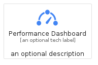
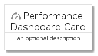
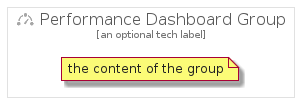

# PerformanceDashboard


```text
gcp/Item/PerformanceDashboard
```

```text
include('gcp/Item/PerformanceDashboard')
```


| Illustration | PerformanceDashboard | PerformanceDashboardCard | PerformanceDashboardGroup |
| :---: | :---: | :---: | :---: |
|  |  |  |  |


## Sprites
The item provides the following sriptes:

- `<$PerformanceDashboardXs>`
- `<$PerformanceDashboardSm>`
- `<$PerformanceDashboardMd>`
- `<$PerformanceDashboardLg>`


## PerformanceDashboard

### Load remotely
```plantuml
@startuml
' configures the library
!global $LIB_BASE_LOCATION="https://raw.githubusercontent.com/tmorin/plantuml-libs/master/distribution"

' loads the library's bootstrap
!include $LIB_BASE_LOCATION/bootstrap.puml

' loads the package bootstrap
include('gcp/bootstrap')

' loads the Item which embeds the element PerformanceDashboard
include('gcp/Item/PerformanceDashboard')

' renders the element
PerformanceDashboard('PerformanceDashboard', 'Performance Dashboard', 'an optional tech label', 'an optional description')
@enduml
```

### Load locally
```plantuml
@startuml
' configures the library
!global $INCLUSION_MODE="local"
!global $LIB_BASE_LOCATION="../.."

' loads the library's bootstrap
!include $LIB_BASE_LOCATION/bootstrap.puml

' loads the package bootstrap
include('gcp/bootstrap')

' loads the Item which embeds the element PerformanceDashboard
include('gcp/Item/PerformanceDashboard')

' renders the element
PerformanceDashboard('PerformanceDashboard', 'Performance Dashboard', 'an optional tech label', 'an optional description')
@enduml
```

## PerformanceDashboardCard

### Load remotely
```plantuml
@startuml
' configures the library
!global $LIB_BASE_LOCATION="https://raw.githubusercontent.com/tmorin/plantuml-libs/master/distribution"

' loads the library's bootstrap
!include $LIB_BASE_LOCATION/bootstrap.puml

' loads the package bootstrap
include('gcp/bootstrap')

' loads the Item which embeds the element PerformanceDashboardCard
include('gcp/Item/PerformanceDashboard')

' renders the element
PerformanceDashboardCard('PerformanceDashboardCard', 'Performance Dashboard Card', 'an optional description')
@enduml
```

### Load locally
```plantuml
@startuml
' configures the library
!global $INCLUSION_MODE="local"
!global $LIB_BASE_LOCATION="../.."

' loads the library's bootstrap
!include $LIB_BASE_LOCATION/bootstrap.puml

' loads the package bootstrap
include('gcp/bootstrap')

' loads the Item which embeds the element PerformanceDashboardCard
include('gcp/Item/PerformanceDashboard')

' renders the element
PerformanceDashboardCard('PerformanceDashboardCard', 'Performance Dashboard Card', 'an optional description')
@enduml
```

## PerformanceDashboardGroup

### Load remotely
```plantuml
@startuml
' configures the library
!global $LIB_BASE_LOCATION="https://raw.githubusercontent.com/tmorin/plantuml-libs/master/distribution"

' loads the library's bootstrap
!include $LIB_BASE_LOCATION/bootstrap.puml

' loads the package bootstrap
include('gcp/bootstrap')

' loads the Item which embeds the element PerformanceDashboardGroup
include('gcp/Item/PerformanceDashboard')

' renders the element
PerformanceDashboardGroup('PerformanceDashboardGroup', 'Performance Dashboard Group', 'an optional tech label') {
    note as note
        the content of the group
    end note
}
@enduml
```

### Load locally
```plantuml
@startuml
' configures the library
!global $INCLUSION_MODE="local"
!global $LIB_BASE_LOCATION="../.."

' loads the library's bootstrap
!include $LIB_BASE_LOCATION/bootstrap.puml

' loads the package bootstrap
include('gcp/bootstrap')

' loads the Item which embeds the element PerformanceDashboardGroup
include('gcp/Item/PerformanceDashboard')

' renders the element
PerformanceDashboardGroup('PerformanceDashboardGroup', 'Performance Dashboard Group', 'an optional tech label') {
    note as note
        the content of the group
    end note
}
@enduml
```

