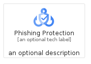
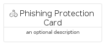
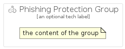

# PhishingProtection


```text
gcp/Item/PhishingProtection
```

```text
include('gcp/Item/PhishingProtection')
```


| Illustration | PhishingProtection | PhishingProtectionCard | PhishingProtectionGroup |
| :---: | :---: | :---: | :---: |
|  |  |  |  |


## PhishingProtection

### Load remotely
```plantuml
@startuml
' configures the library
!global $LIB_BASE_LOCATION="https://raw.githubusercontent.com/tmorin/plantuml-libs/master/distribution"

' loads the library's bootstrap
!include $LIB_BASE_LOCATION/bootstrap.puml

' loads the package bootstrap
include('gcp/bootstrap')

' loads the Item which embeds the element PhishingProtection
include('gcp/Item/PhishingProtection')

' renders the element
PhishingProtection('PhishingProtection', 'Phishing Protection', 'an optional tech label')
@enduml
```

### Load locally
```plantuml
@startuml
' configures the library
!global $INCLUSION_MODE="local"
!global $LIB_BASE_LOCATION="../.."

' loads the library's bootstrap
!include $LIB_BASE_LOCATION/bootstrap.puml

' loads the package bootstrap
include('gcp/bootstrap')

' loads the Item which embeds the element PhishingProtection
include('gcp/Item/PhishingProtection')

' renders the element
PhishingProtection('PhishingProtection', 'Phishing Protection', 'an optional tech label')
@enduml
```

## PhishingProtectionCard

### Load remotely
```plantuml
@startuml
' configures the library
!global $LIB_BASE_LOCATION="https://raw.githubusercontent.com/tmorin/plantuml-libs/master/distribution"

' loads the library's bootstrap
!include $LIB_BASE_LOCATION/bootstrap.puml

' loads the package bootstrap
include('gcp/bootstrap')

' loads the Item which embeds the element PhishingProtectionCard
include('gcp/Item/PhishingProtection')

' renders the element
PhishingProtectionCard('PhishingProtectionCard', 'Phishing Protection Card', 'an optional description')
@enduml
```

### Load locally
```plantuml
@startuml
' configures the library
!global $INCLUSION_MODE="local"
!global $LIB_BASE_LOCATION="../.."

' loads the library's bootstrap
!include $LIB_BASE_LOCATION/bootstrap.puml

' loads the package bootstrap
include('gcp/bootstrap')

' loads the Item which embeds the element PhishingProtectionCard
include('gcp/Item/PhishingProtection')

' renders the element
PhishingProtectionCard('PhishingProtectionCard', 'Phishing Protection Card', 'an optional description')
@enduml
```

## PhishingProtectionGroup

### Load remotely
```plantuml
@startuml
' configures the library
!global $LIB_BASE_LOCATION="https://raw.githubusercontent.com/tmorin/plantuml-libs/master/distribution"

' loads the library's bootstrap
!include $LIB_BASE_LOCATION/bootstrap.puml

' loads the package bootstrap
include('gcp/bootstrap')

' loads the Item which embeds the element PhishingProtectionGroup
include('gcp/Item/PhishingProtection')

' renders the element
PhishingProtectionGroup('PhishingProtectionGroup', 'Phishing Protection Group', 'an optional tech label') {
    note as note
        the content of the group
    end note
}
@enduml
```

### Load locally
```plantuml
@startuml
' configures the library
!global $INCLUSION_MODE="local"
!global $LIB_BASE_LOCATION="../.."

' loads the library's bootstrap
!include $LIB_BASE_LOCATION/bootstrap.puml

' loads the package bootstrap
include('gcp/bootstrap')

' loads the Item which embeds the element PhishingProtectionGroup
include('gcp/Item/PhishingProtection')

' renders the element
PhishingProtectionGroup('PhishingProtectionGroup', 'Phishing Protection Group', 'an optional tech label') {
    note as note
        the content of the group
    end note
}
@enduml
```

