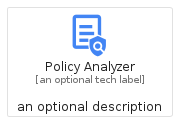
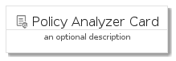
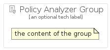

# PolicyAnalyzer


```text
gcp/Item/PolicyAnalyzer
```

```text
include('gcp/Item/PolicyAnalyzer')
```


| Illustration | PolicyAnalyzer | PolicyAnalyzerCard | PolicyAnalyzerGroup |
| :---: | :---: | :---: | :---: |
|  |  |  |  |


## PolicyAnalyzer

### Load remotely
```plantuml
@startuml
' configures the library
!global $LIB_BASE_LOCATION="https://raw.githubusercontent.com/tmorin/plantuml-libs/master/distribution"

' loads the library's bootstrap
!include $LIB_BASE_LOCATION/bootstrap.puml

' loads the package bootstrap
include('gcp/bootstrap')

' loads the Item which embeds the element PolicyAnalyzer
include('gcp/Item/PolicyAnalyzer')

' renders the element
PolicyAnalyzer('PolicyAnalyzer', 'Policy Analyzer', 'an optional tech label')
@enduml
```

### Load locally
```plantuml
@startuml
' configures the library
!global $INCLUSION_MODE="local"
!global $LIB_BASE_LOCATION="../.."

' loads the library's bootstrap
!include $LIB_BASE_LOCATION/bootstrap.puml

' loads the package bootstrap
include('gcp/bootstrap')

' loads the Item which embeds the element PolicyAnalyzer
include('gcp/Item/PolicyAnalyzer')

' renders the element
PolicyAnalyzer('PolicyAnalyzer', 'Policy Analyzer', 'an optional tech label')
@enduml
```

## PolicyAnalyzerCard

### Load remotely
```plantuml
@startuml
' configures the library
!global $LIB_BASE_LOCATION="https://raw.githubusercontent.com/tmorin/plantuml-libs/master/distribution"

' loads the library's bootstrap
!include $LIB_BASE_LOCATION/bootstrap.puml

' loads the package bootstrap
include('gcp/bootstrap')

' loads the Item which embeds the element PolicyAnalyzerCard
include('gcp/Item/PolicyAnalyzer')

' renders the element
PolicyAnalyzerCard('PolicyAnalyzerCard', 'Policy Analyzer Card', 'an optional description')
@enduml
```

### Load locally
```plantuml
@startuml
' configures the library
!global $INCLUSION_MODE="local"
!global $LIB_BASE_LOCATION="../.."

' loads the library's bootstrap
!include $LIB_BASE_LOCATION/bootstrap.puml

' loads the package bootstrap
include('gcp/bootstrap')

' loads the Item which embeds the element PolicyAnalyzerCard
include('gcp/Item/PolicyAnalyzer')

' renders the element
PolicyAnalyzerCard('PolicyAnalyzerCard', 'Policy Analyzer Card', 'an optional description')
@enduml
```

## PolicyAnalyzerGroup

### Load remotely
```plantuml
@startuml
' configures the library
!global $LIB_BASE_LOCATION="https://raw.githubusercontent.com/tmorin/plantuml-libs/master/distribution"

' loads the library's bootstrap
!include $LIB_BASE_LOCATION/bootstrap.puml

' loads the package bootstrap
include('gcp/bootstrap')

' loads the Item which embeds the element PolicyAnalyzerGroup
include('gcp/Item/PolicyAnalyzer')

' renders the element
PolicyAnalyzerGroup('PolicyAnalyzerGroup', 'Policy Analyzer Group', 'an optional tech label') {
    note as note
        the content of the group
    end note
}
@enduml
```

### Load locally
```plantuml
@startuml
' configures the library
!global $INCLUSION_MODE="local"
!global $LIB_BASE_LOCATION="../.."

' loads the library's bootstrap
!include $LIB_BASE_LOCATION/bootstrap.puml

' loads the package bootstrap
include('gcp/bootstrap')

' loads the Item which embeds the element PolicyAnalyzerGroup
include('gcp/Item/PolicyAnalyzer')

' renders the element
PolicyAnalyzerGroup('PolicyAnalyzerGroup', 'Policy Analyzer Group', 'an optional tech label') {
    note as note
        the content of the group
    end note
}
@enduml
```

