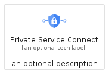
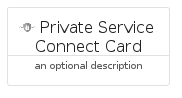
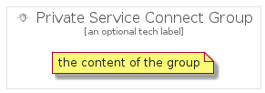

# PrivateServiceConnect


```text
gcp/Item/PrivateServiceConnect
```

```text
include('gcp/Item/PrivateServiceConnect')
```


| Illustration | PrivateServiceConnect | PrivateServiceConnectCard | PrivateServiceConnectGroup |
| :---: | :---: | :---: | :---: |
|  |  |  |  |


## Sprites
The item provides the following sriptes:

- `<$PrivateServiceConnectXs>`
- `<$PrivateServiceConnectSm>`
- `<$PrivateServiceConnectMd>`
- `<$PrivateServiceConnectLg>`


## PrivateServiceConnect

### Load remotely
```plantuml
@startuml
' configures the library
!global $LIB_BASE_LOCATION="https://raw.githubusercontent.com/tmorin/plantuml-libs/master/distribution"

' loads the library's bootstrap
!include $LIB_BASE_LOCATION/bootstrap.puml

' loads the package bootstrap
include('gcp/bootstrap')

' loads the Item which embeds the element PrivateServiceConnect
include('gcp/Item/PrivateServiceConnect')

' renders the element
PrivateServiceConnect('PrivateServiceConnect', 'Private Service Connect', 'an optional tech label', 'an optional description')
@enduml
```

### Load locally
```plantuml
@startuml
' configures the library
!global $INCLUSION_MODE="local"
!global $LIB_BASE_LOCATION="../.."

' loads the library's bootstrap
!include $LIB_BASE_LOCATION/bootstrap.puml

' loads the package bootstrap
include('gcp/bootstrap')

' loads the Item which embeds the element PrivateServiceConnect
include('gcp/Item/PrivateServiceConnect')

' renders the element
PrivateServiceConnect('PrivateServiceConnect', 'Private Service Connect', 'an optional tech label', 'an optional description')
@enduml
```

## PrivateServiceConnectCard

### Load remotely
```plantuml
@startuml
' configures the library
!global $LIB_BASE_LOCATION="https://raw.githubusercontent.com/tmorin/plantuml-libs/master/distribution"

' loads the library's bootstrap
!include $LIB_BASE_LOCATION/bootstrap.puml

' loads the package bootstrap
include('gcp/bootstrap')

' loads the Item which embeds the element PrivateServiceConnectCard
include('gcp/Item/PrivateServiceConnect')

' renders the element
PrivateServiceConnectCard('PrivateServiceConnectCard', 'Private Service Connect Card', 'an optional description')
@enduml
```

### Load locally
```plantuml
@startuml
' configures the library
!global $INCLUSION_MODE="local"
!global $LIB_BASE_LOCATION="../.."

' loads the library's bootstrap
!include $LIB_BASE_LOCATION/bootstrap.puml

' loads the package bootstrap
include('gcp/bootstrap')

' loads the Item which embeds the element PrivateServiceConnectCard
include('gcp/Item/PrivateServiceConnect')

' renders the element
PrivateServiceConnectCard('PrivateServiceConnectCard', 'Private Service Connect Card', 'an optional description')
@enduml
```

## PrivateServiceConnectGroup

### Load remotely
```plantuml
@startuml
' configures the library
!global $LIB_BASE_LOCATION="https://raw.githubusercontent.com/tmorin/plantuml-libs/master/distribution"

' loads the library's bootstrap
!include $LIB_BASE_LOCATION/bootstrap.puml

' loads the package bootstrap
include('gcp/bootstrap')

' loads the Item which embeds the element PrivateServiceConnectGroup
include('gcp/Item/PrivateServiceConnect')

' renders the element
PrivateServiceConnectGroup('PrivateServiceConnectGroup', 'Private Service Connect Group', 'an optional tech label') {
    note as note
        the content of the group
    end note
}
@enduml
```

### Load locally
```plantuml
@startuml
' configures the library
!global $INCLUSION_MODE="local"
!global $LIB_BASE_LOCATION="../.."

' loads the library's bootstrap
!include $LIB_BASE_LOCATION/bootstrap.puml

' loads the package bootstrap
include('gcp/bootstrap')

' loads the Item which embeds the element PrivateServiceConnectGroup
include('gcp/Item/PrivateServiceConnect')

' renders the element
PrivateServiceConnectGroup('PrivateServiceConnectGroup', 'Private Service Connect Group', 'an optional tech label') {
    note as note
        the content of the group
    end note
}
@enduml
```

