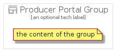

# ProducerPortal


```text
gcp/Item/ProducerPortal
```

```text
include('gcp/Item/ProducerPortal')
```


| Illustration | ProducerPortal | ProducerPortalCard | ProducerPortalGroup |
| :---: | :---: | :---: | :---: |
|  |  |  |  |


## ProducerPortal

### Load remotely
```plantuml
@startuml
' configures the library
!global $LIB_BASE_LOCATION="https://raw.githubusercontent.com/tmorin/plantuml-libs/master/distribution"

' loads the library's bootstrap
!include $LIB_BASE_LOCATION/bootstrap.puml

' loads the package bootstrap
include('gcp/bootstrap')

' loads the Item which embeds the element ProducerPortal
include('gcp/Item/ProducerPortal')

' renders the element
ProducerPortal('ProducerPortal', 'Producer Portal', 'an optional tech label')
@enduml
```

### Load locally
```plantuml
@startuml
' configures the library
!global $INCLUSION_MODE="local"
!global $LIB_BASE_LOCATION="../.."

' loads the library's bootstrap
!include $LIB_BASE_LOCATION/bootstrap.puml

' loads the package bootstrap
include('gcp/bootstrap')

' loads the Item which embeds the element ProducerPortal
include('gcp/Item/ProducerPortal')

' renders the element
ProducerPortal('ProducerPortal', 'Producer Portal', 'an optional tech label')
@enduml
```

## ProducerPortalCard

### Load remotely
```plantuml
@startuml
' configures the library
!global $LIB_BASE_LOCATION="https://raw.githubusercontent.com/tmorin/plantuml-libs/master/distribution"

' loads the library's bootstrap
!include $LIB_BASE_LOCATION/bootstrap.puml

' loads the package bootstrap
include('gcp/bootstrap')

' loads the Item which embeds the element ProducerPortalCard
include('gcp/Item/ProducerPortal')

' renders the element
ProducerPortalCard('ProducerPortalCard', 'Producer Portal Card', 'an optional description')
@enduml
```

### Load locally
```plantuml
@startuml
' configures the library
!global $INCLUSION_MODE="local"
!global $LIB_BASE_LOCATION="../.."

' loads the library's bootstrap
!include $LIB_BASE_LOCATION/bootstrap.puml

' loads the package bootstrap
include('gcp/bootstrap')

' loads the Item which embeds the element ProducerPortalCard
include('gcp/Item/ProducerPortal')

' renders the element
ProducerPortalCard('ProducerPortalCard', 'Producer Portal Card', 'an optional description')
@enduml
```

## ProducerPortalGroup

### Load remotely
```plantuml
@startuml
' configures the library
!global $LIB_BASE_LOCATION="https://raw.githubusercontent.com/tmorin/plantuml-libs/master/distribution"

' loads the library's bootstrap
!include $LIB_BASE_LOCATION/bootstrap.puml

' loads the package bootstrap
include('gcp/bootstrap')

' loads the Item which embeds the element ProducerPortalGroup
include('gcp/Item/ProducerPortal')

' renders the element
ProducerPortalGroup('ProducerPortalGroup', 'Producer Portal Group', 'an optional tech label') {
    note as note
        the content of the group
    end note
}
@enduml
```

### Load locally
```plantuml
@startuml
' configures the library
!global $INCLUSION_MODE="local"
!global $LIB_BASE_LOCATION="../.."

' loads the library's bootstrap
!include $LIB_BASE_LOCATION/bootstrap.puml

' loads the package bootstrap
include('gcp/bootstrap')

' loads the Item which embeds the element ProducerPortalGroup
include('gcp/Item/ProducerPortal')

' renders the element
ProducerPortalGroup('ProducerPortalGroup', 'Producer Portal Group', 'an optional tech label') {
    note as note
        the content of the group
    end note
}
@enduml
```

